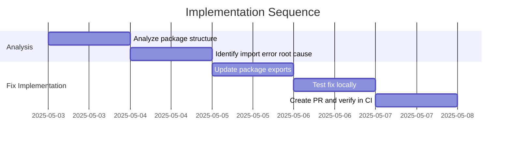

# Implementation Plan: Fix ImportError for Adaptable

## 1. Overview

### 1.1 Component Purpose

This implementation plan addresses the `ImportError: cannot import name 'Adaptable' from 'pydapter'` occurring during test execution in the CI environment. This is blocking the stabilization effort tracked in Issue #2.

### 1.2 Design Reference

This implementation is based on Issue #2, which includes fixing CI issues.

### 1.3 Implementation Approach

We'll follow a systematic approach:
1. Analyze the current package structure and imports
2. Identify the root cause of the import error
3. Implement a fix to ensure proper exporting of the `Adaptable` class
4. Verify the fix locally and in CI

## 2. Implementation Phases

### 2.1 Phase 1: Analysis and Diagnosis

**Key Deliverables:**
- Understanding of the import error root cause
- Identification of the specific issue in the package structure

**Dependencies:**
- Access to the codebase and CI logs

**Estimated Complexity:** Low

### 2.2 Phase 2: Implementation of Fix

**Key Deliverables:**
- Updated package structure to fix the import error
- Passing tests in CI environment

**Dependencies:**
- Understanding of Python's import system
- Identification of the specific issue causing the import error

**Estimated Complexity:** Low

## 3. Test Strategy

### 3.1 Unit Tests

The existing test suite should be sufficient to verify the fix, as the issue is with importing the package, not with the functionality itself.

## 4. Implementation Tasks

### 4.1 Analysis

| ID  | Task                                | Description                                                       | Dependencies | Priority | Complexity |
| --- | ----------------------------------- | ----------------------------------------------------------------- | ------------ | -------- | ---------- |
| T-1 | Analyze package structure           | Review the package structure and import statements                | None         | High     | Low        |
| T-2 | Identify import error root cause    | Determine why `Adaptable` cannot be imported in CI               | T-1          | High     | Low        |

### 4.2 Fix Implementation

| ID  | Task                                | Description                                                       | Dependencies | Priority | Complexity |
| --- | ----------------------------------- | ----------------------------------------------------------------- | ------------ | -------- | ---------- |
| T-3 | Update package exports              | Modify `__init__.py` to ensure proper exporting of `Adaptable`   | T-2          | High     | Low        |
| T-4 | Test fix locally                    | Verify that the fix works in a local environment                  | T-3          | High     | Low        |
| T-5 | Create PR and verify in CI          | Create a PR and verify that the tests pass in CI                  | T-4          | High     | Low        |

## 5. Implementation Sequence



## 6. Acceptance Criteria

### 6.1 Component Level

| ID   | Criterion                                           | Validation Method            |
| ---- | --------------------------------------------------- | ---------------------------- |
| AC-1 | The `Adaptable` class can be imported from `pydapter` | Tests pass in CI environment |
| AC-2 | All existing functionality works as expected        | All tests pass               |

## 7. Test Implementation Plan

### 7.1 Test Implementation Sequence

1. Run existing tests locally to confirm they pass
2. Implement the fix
3. Run tests locally again to verify the fix
4. Create a PR and verify that the tests pass in CI

## 8. Implementation Risks and Mitigations

| Risk                                       | Impact | Likelihood | Mitigation                                                                                                  |
| ------------------------------------------ | ------ | ---------- | ----------------------------------------------------------------------------------------------------------- |
| Fix breaks other imports                   | High   | Low        | Ensure comprehensive test coverage for all package functionality                                            |
| Issue is more complex than anticipated     | Medium | Low        | Be prepared to investigate deeper issues with Python's import system                                        |

## 9. Dependencies and Environment

### 9.1 External Libraries

No additional external libraries are required for this fix.

### 9.2 Environment Setup

```bash
# Create virtual environment
python -m venv venv
source venv/bin/activate

# Install dependencies
uv pip install -e .[all,test]

# Run tests
pytest
```

## 10. Additional Resources

### 10.1 Reference Implementation

N/A

### 10.2 Relevant Documentation

- [Python Import System](https://docs.python.org/3/reference/import.html)
- [Packaging Python Projects](https://packaging.python.org/en/latest/tutorials/packaging-projects/)

### 10.3 Design Patterns

N/A