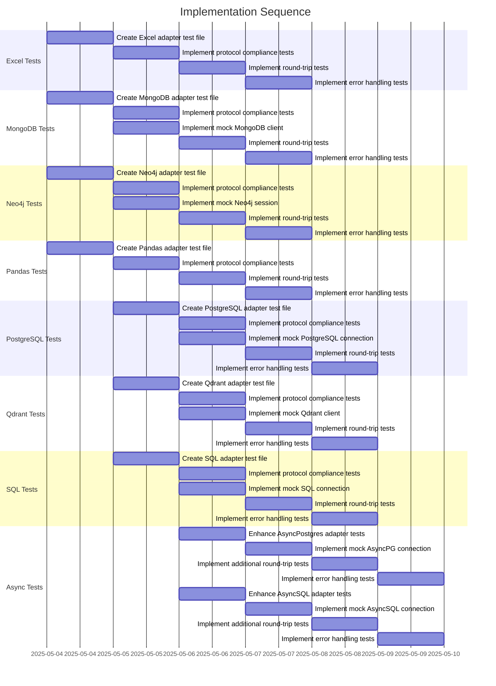

# Implementation Plan: Increase Test Coverage for PR #24

## 1. Overview

### 1.1 Component Purpose

This implementation plan outlines the approach for increasing test coverage in the pydapter project to meet the ≥80% project requirement. The focus will be on adding tests for modules with low or no coverage, particularly in the `extras` directory.

### 1.2 Design Reference

This implementation is based on the existing test framework established in PR #24 (issue #15), which implemented core unit tests for pydapter's interfaces. The goal is to extend this coverage to meet the project's quality standards.

### 1.3 Implementation Approach

The implementation will follow Test-Driven Development (TDD) principles, focusing on:

1. Identifying modules with low or no coverage
2. Creating targeted tests for these modules
3. Ensuring comprehensive coverage of edge cases
4. Leveraging existing test infrastructure and fixtures

## 2. Implementation Phases

### 2.1 Phase 1: Coverage Analysis

**Description:** Analyze the current test coverage to identify modules with low or no coverage.

**Key Deliverables:**
- Detailed list of modules requiring additional tests
- Prioritization of modules based on importance and complexity

**Dependencies:**
- Existing test suite
- Coverage reports

**Estimated Complexity:** Low

### 2.2 Phase 2: Synchronous Extras Module Tests

**Description:** Implement tests for synchronous extras modules with low or no coverage.

**Key Deliverables:**
- Tests for `excel_.py`
- Tests for `mongo_.py`
- Tests for `neo4j_.py`
- Tests for `pandas_.py`
- Tests for `postgres_.py`
- Tests for `qdrant_.py`
- Tests for `sql_.py`

**Dependencies:**
- Existing test infrastructure
- Mock objects for external dependencies

**Estimated Complexity:** Medium

### 2.3 Phase 3: Asynchronous Extras Module Tests

**Description:** Implement tests for asynchronous extras modules with low coverage.

**Key Deliverables:**
- Additional tests for `async_postgres_.py`
- Additional tests for `async_sql_.py`

**Dependencies:**
- Existing async test infrastructure
- Mock objects for external async dependencies

**Estimated Complexity:** High

### 2.4 Phase 4: Edge Case and Error Handling Tests

**Description:** Implement additional tests for edge cases and error handling in all modules.

**Key Deliverables:**
- Edge case tests for all adapters
- Error handling tests for all adapters

**Dependencies:**
- Phases 2 and 3

**Estimated Complexity:** Medium

## 3. Test Strategy

### 3.1 Unit Tests

#### 3.1.1 Test Group: Synchronous Extras Adapters

| ID   | Description                                                     | Fixtures/Mocks | Assertions                                                 |
| ---- | --------------------------------------------------------------- | -------------- | ---------------------------------------------------------- |
| UT-1 | Test Excel adapter protocol compliance                          | None           | Class implements Adapter protocol, has required attributes |
| UT-2 | Test Excel adapter round-trip conversion                        | Sample model   | Round-trip conversion preserves data                       |
| UT-3 | Test MongoDB adapter protocol compliance                        | None           | Class implements Adapter protocol, has required attributes |
| UT-4 | Test MongoDB adapter round-trip conversion                      | Mock MongoDB   | Round-trip conversion preserves data                       |
| UT-5 | Test Neo4j adapter protocol compliance                          | None           | Class implements Adapter protocol, has required attributes |
| UT-6 | Test Neo4j adapter round-trip conversion                        | Mock Neo4j     | Round-trip conversion preserves data                       |
| UT-7 | Test Pandas adapter protocol compliance                         | None           | Class implements Adapter protocol, has required attributes |
| UT-8 | Test Pandas adapter round-trip conversion                       | Sample model   | Round-trip conversion preserves data                       |
| UT-9 | Test PostgreSQL adapter protocol compliance                     | None           | Class implements Adapter protocol, has required attributes |
| UT-10 | Test PostgreSQL adapter round-trip conversion                  | Mock PostgreSQL| Round-trip conversion preserves data                       |
| UT-11 | Test Qdrant adapter protocol compliance                        | None           | Class implements Adapter protocol, has required attributes |
| UT-12 | Test Qdrant adapter round-trip conversion                      | Mock Qdrant    | Round-trip conversion preserves data                       |
| UT-13 | Test SQL adapter protocol compliance                           | None           | Class implements Adapter protocol, has required attributes |
| UT-14 | Test SQL adapter round-trip conversion                         | Mock SQL       | Round-trip conversion preserves data                       |

#### 3.1.2 Test Group: Asynchronous Extras Adapters

| ID   | Description                                                     | Fixtures/Mocks | Assertions                                                 |
| ---- | --------------------------------------------------------------- | -------------- | ---------------------------------------------------------- |
| UT-15 | Test AsyncPostgres adapter with mocked connection              | Mock AsyncPG   | Adapter correctly interacts with mocked connection         |
| UT-16 | Test AsyncSQL adapter with mocked connection                   | Mock AsyncSQL  | Adapter correctly interacts with mocked connection         |

### 3.2 Integration Tests

#### 3.2.1 Test Group: External System Interactions

| ID   | Description                                                    | Setup                                                      | Assertions                                                         |
| ---- | -------------------------------------------------------------- | ---------------------------------------------------------- | ------------------------------------------------------------------ |
| IT-1 | Test Excel adapter with actual file                            | Create temporary Excel file                                | Adapter correctly reads/writes Excel files                          |
| IT-2 | Test Pandas adapter with DataFrame                             | Create Pandas DataFrame                                    | Adapter correctly converts between model and DataFrame              |

### 3.3 Mock and Stub Requirements

| Dependency         | Mock/Stub Type | Key Behaviors to Mock                                 |
| ------------------ | -------------- | ----------------------------------------------------- |
| Excel              | Mock           | File operations, workbook/worksheet handling          |
| MongoDB            | Mock           | Connection, query execution, result retrieval         |
| Neo4j              | Mock           | Session, transaction, query execution                 |
| Pandas             | Mock           | DataFrame operations                                  |
| PostgreSQL         | Mock           | Connection, query execution, result retrieval         |
| Qdrant             | Mock           | Client operations, vector search                      |
| SQL                | Mock           | Connection, query execution, result retrieval         |

## 4. Implementation Tasks

### 4.1 Excel Adapter Tests

| ID  | Task                                | Description                                                       | Dependencies | Priority | Complexity |
| --- | ----------------------------------- | ----------------------------------------------------------------- | ------------ | -------- | ---------- |
| T-1 | Create Excel adapter test file      | Create test file for Excel adapter                                | None         | High     | Low        |
| T-2 | Implement protocol compliance tests | Test that Excel adapter implements the Adapter protocol           | T-1          | High     | Low        |
| T-3 | Implement round-trip tests          | Test round-trip conversion with Excel adapter                     | T-1, T-2     | High     | Medium     |
| T-4 | Implement error handling tests      | Test error conditions for Excel adapter                           | T-1, T-3     | Medium   | Medium     |

### 4.2 MongoDB Adapter Tests

| ID  | Task                                | Description                                                       | Dependencies | Priority | Complexity |
| --- | ----------------------------------- | ----------------------------------------------------------------- | ------------ | -------- | ---------- |
| T-5 | Create MongoDB adapter test file    | Create test file for MongoDB adapter                              | None         | High     | Low        |
| T-6 | Implement protocol compliance tests | Test that MongoDB adapter implements the Adapter protocol         | T-5          | High     | Low        |
| T-7 | Implement mock MongoDB client       | Create mock MongoDB client for testing                            | T-5          | High     | Medium     |
| T-8 | Implement round-trip tests          | Test round-trip conversion with MongoDB adapter                   | T-5, T-7     | High     | Medium     |
| T-9 | Implement error handling tests      | Test error conditions for MongoDB adapter                         | T-5, T-8     | Medium   | Medium     |

### 4.3 Neo4j Adapter Tests

| ID   | Task                                | Description                                                       | Dependencies | Priority | Complexity |
| ---- | ----------------------------------- | ----------------------------------------------------------------- | ------------ | -------- | ---------- |
| T-10 | Create Neo4j adapter test file      | Create test file for Neo4j adapter                                | None         | High     | Low        |
| T-11 | Implement protocol compliance tests | Test that Neo4j adapter implements the Adapter protocol           | T-10         | High     | Low        |
| T-12 | Implement mock Neo4j session        | Create mock Neo4j session for testing                             | T-10         | High     | Medium     |
| T-13 | Implement round-trip tests          | Test round-trip conversion with Neo4j adapter                     | T-10, T-12   | High     | Medium     |
| T-14 | Implement error handling tests      | Test error conditions for Neo4j adapter                           | T-10, T-13   | Medium   | Medium     |

### 4.4 Pandas Adapter Tests

| ID   | Task                                | Description                                                       | Dependencies | Priority | Complexity |
| ---- | ----------------------------------- | ----------------------------------------------------------------- | ------------ | -------- | ---------- |
| T-15 | Create Pandas adapter test file     | Create test file for Pandas adapter                               | None         | High     | Low        |
| T-16 | Implement protocol compliance tests | Test that Pandas adapter implements the Adapter protocol          | T-15         | High     | Low        |
| T-17 | Implement round-trip tests          | Test round-trip conversion with Pandas adapter                    | T-15         | High     | Medium     |
| T-18 | Implement error handling tests      | Test error conditions for Pandas adapter                          | T-15, T-17   | Medium   | Medium     |

### 4.5 PostgreSQL Adapter Tests

| ID   | Task                                | Description                                                       | Dependencies | Priority | Complexity |
| ---- | ----------------------------------- | ----------------------------------------------------------------- | ------------ | -------- | ---------- |
| T-19 | Create PostgreSQL adapter test file | Create test file for PostgreSQL adapter                           | None         | High     | Low        |
| T-20 | Implement protocol compliance tests | Test that PostgreSQL adapter implements the Adapter protocol      | T-19         | High     | Low        |
| T-21 | Implement mock PostgreSQL connection| Create mock PostgreSQL connection for testing                     | T-19         | High     | Medium     |
| T-22 | Implement round-trip tests          | Test round-trip conversion with PostgreSQL adapter                | T-19, T-21   | High     | Medium     |
| T-23 | Implement error handling tests      | Test error conditions for PostgreSQL adapter                      | T-19, T-22   | Medium   | Medium     |

### 4.6 Qdrant Adapter Tests

| ID   | Task                                | Description                                                       | Dependencies | Priority | Complexity |
| ---- | ----------------------------------- | ----------------------------------------------------------------- | ------------ | -------- | ---------- |
| T-24 | Create Qdrant adapter test file     | Create test file for Qdrant adapter                               | None         | High     | Low        |
| T-25 | Implement protocol compliance tests | Test that Qdrant adapter implements the Adapter protocol          | T-24         | High     | Low        |
| T-26 | Implement mock Qdrant client        | Create mock Qdrant client for testing                             | T-24         | High     | Medium     |
| T-27 | Implement round-trip tests          | Test round-trip conversion with Qdrant adapter                    | T-24, T-26   | High     | Medium     |
| T-28 | Implement error handling tests      | Test error conditions for Qdrant adapter                          | T-24, T-27   | Medium   | Medium     |

### 4.7 SQL Adapter Tests

| ID   | Task                                | Description                                                       | Dependencies | Priority | Complexity |
| ---- | ----------------------------------- | ----------------------------------------------------------------- | ------------ | -------- | ---------- |
| T-29 | Create SQL adapter test file        | Create test file for SQL adapter                                  | None         | High     | Low        |
| T-30 | Implement protocol compliance tests | Test that SQL adapter implements the Adapter protocol             | T-29         | High     | Low        |
| T-31 | Implement mock SQL connection       | Create mock SQL connection for testing                            | T-29         | High     | Medium     |
| T-32 | Implement round-trip tests          | Test round-trip conversion with SQL adapter                       | T-29, T-31   | High     | Medium     |
| T-33 | Implement error handling tests      | Test error conditions for SQL adapter                             | T-29, T-32   | Medium   | Medium     |

### 4.8 Async PostgreSQL Adapter Tests

| ID   | Task                                | Description                                                       | Dependencies | Priority | Complexity |
| ---- | ----------------------------------- | ----------------------------------------------------------------- | ------------ | -------- | ---------- |
| T-34 | Enhance AsyncPostgres adapter tests | Add more tests for AsyncPostgres adapter                          | None         | High     | Medium     |
| T-35 | Implement mock AsyncPG connection   | Create mock AsyncPG connection for testing                        | T-34         | High     | High       |
| T-36 | Implement additional round-trip tests| Test additional round-trip scenarios with AsyncPostgres adapter  | T-34, T-35   | High     | Medium     |
| T-37 | Implement error handling tests      | Test error conditions for AsyncPostgres adapter                   | T-34, T-36   | Medium   | Medium     |

### 4.9 Async SQL Adapter Tests

| ID   | Task                                | Description                                                       | Dependencies | Priority | Complexity |
| ---- | ----------------------------------- | ----------------------------------------------------------------- | ------------ | -------- | ---------- |
| T-38 | Enhance AsyncSQL adapter tests      | Add more tests for AsyncSQL adapter                               | None         | High     | Medium     |
| T-39 | Implement mock AsyncSQL connection  | Create mock AsyncSQL connection for testing                       | T-38         | High     | High       |
| T-40 | Implement additional round-trip tests| Test additional round-trip scenarios with AsyncSQL adapter       | T-38, T-39   | High     | Medium     |
| T-41 | Implement error handling tests      | Test error conditions for AsyncSQL adapter                        | T-38, T-40   | Medium   | Medium     |

## 5. Implementation Sequence



## 6. Acceptance Criteria

### 6.1 Coverage Level

| ID   | Criterion                                           | Validation Method            |
| ---- | --------------------------------------------------- | ---------------------------- |
| AC-1 | Overall test coverage is at least 80%               | pytest-cov report            |
| AC-2 | No module has 0% coverage                           | pytest-cov report            |
| AC-3 | Core modules have at least 90% coverage             | pytest-cov report            |
| AC-4 | All tests pass                                      | pytest execution             |

### 6.2 Test Quality

| ID   | Criterion                                                  | Validation Method          |
| ---- | ---------------------------------------------------------- | -------------------------- |
| AC-5 | All adapters have protocol compliance tests                | Code review                |
| AC-6 | All adapters have round-trip conversion tests              | Code review                |
| AC-7 | All adapters have error handling tests                     | Code review                |
| AC-8 | Tests use appropriate mocks for external dependencies      | Code review                |

## 7. Test Implementation Plan

### 7.1 Test Implementation Sequence

1. Implement protocol compliance tests for all adapters
2. Implement mock objects for external dependencies
3. Implement round-trip conversion tests
4. Implement error handling tests
5. Run coverage analysis and add tests for any remaining gaps

### 7.2 Test Code Examples

#### Protocol Compliance Test Example

```python
def test_excel_adapter_protocol_compliance():
    """Test that ExcelAdapter implements the Adapter protocol."""
    from pydapter.extras.excel_ import ExcelAdapter
    from pydapter.core import Adapter
    
    # Verify the adapter implements the protocol
    assert hasattr(ExcelAdapter, "obj_key")
    assert isinstance(ExcelAdapter.obj_key, str)
    
    # Verify method signatures
    assert hasattr(ExcelAdapter, "from_obj")
    assert hasattr(ExcelAdapter, "to_obj")
    
    # Verify the methods can be called as classmethods
    assert callable(ExcelAdapter.from_obj)
    assert callable(ExcelAdapter.to_obj)
```

#### Round-Trip Test Example

```python
def test_excel_adapter_round_trip(tmp_path):
    """Test round-trip conversion with ExcelAdapter."""
    from pydapter.extras.excel_ import ExcelAdapter
    from pydantic import BaseModel
    from pydapter.core import Adaptable
    
    # Create a test model
    class TestModel(Adaptable, BaseModel):
        id: int
        name: str
        value: float
    
    TestModel.register_adapter(ExcelAdapter)
    
    # Create a test instance
    model = TestModel(id=1, name="test", value=42.5)
    
    # Create a temporary file path
    file_path = tmp_path / "test.xlsx"
    
    # Test to_obj
    excel_data = model.adapt_to(obj_key="excel", path=str(file_path))
    
    # Test from_obj
    restored = TestModel.adapt_from({"path": str(file_path)}, obj_key="excel")
    
    # Verify the round-trip
    assert restored == model
```

#### Error Handling Test Example

```python
def test_excel_adapter_error_handling():
    """Test error handling in ExcelAdapter."""
    from pydapter.extras.excel_ import ExcelAdapter
    from pydantic import BaseModel
    from pydapter.core import Adaptable
    
    # Create a test model
    class TestModel(Adaptable, BaseModel):
        id: int
        name: str
        value: float
    
    TestModel.register_adapter(ExcelAdapter)
    
    # Test with invalid file path
    with pytest.raises(FileNotFoundError):
        TestModel.adapt_from({"path": "nonexistent.xlsx"}, obj_key="excel")
```

## 8. Implementation Risks and Mitigations

| Risk                                       | Impact | Likelihood | Mitigation                                                                                                  |
| ------------------------------------------ | ------ | ---------- | ----------------------------------------------------------------------------------------------------------- |
| External dependencies may be difficult to mock | High   | Medium     | Use unittest.mock and create comprehensive mock objects for each external dependency                        |
| Some adapters may require complex setup    | Medium | High       | Focus on protocol compliance and basic functionality first, then add more complex tests                     |
| Async tests may be flaky                   | High   | Medium     | Use proper async test fixtures and isolation to prevent test interference                                   |
| Coverage may still fall short of 80%       | High   | Low        | Prioritize modules with 0% coverage first, then incrementally add tests to reach the target                 |

## 9. Dependencies and Environment

### 9.1 External Libraries

| Library          | Version  | Purpose                                |
| ---------------- | -------- | -------------------------------------- |
| pytest           | >=7.0.0  | Core testing framework                 |
| pytest-cov       | >=4.0.0  | Test coverage reporting                |
| pytest-asyncio   | >=0.21.0 | Asynchronous test support              |
| pytest-mock      | >=3.10.0 | Mocking support                        |
| unittest.mock    | Built-in | Mocking support                        |

### 9.2 Environment Setup

```bash
# Install test dependencies
pip install pytest pytest-cov pytest-asyncio pytest-mock

# Run tests with coverage
pytest tests/ --cov=pydapter

# Run tests with coverage report
pytest tests/ --cov=pydapter --cov-report=term-missing
```

## 10. Additional Resources

### 10.1 Reference Implementation

The existing test files in the project provide a reference for implementation:
- tests/test_async_protocol.py
- tests/test_protocol_compliance.py
- tests/test_error_handling.py
- tests/test_property_based.py
- tests/test_benchmarks.py

### 10.2 Relevant Documentation

- [pytest Documentation](https://docs.pytest.org/)
- [unittest.mock Documentation](https://docs.python.org/3/library/unittest.mock.html)
- [pytest-asyncio Documentation](https://pytest-asyncio.readthedocs.io/)
- [pytest-cov Documentation](https://pytest-cov.readthedocs.io/)

### 10.3 Design Patterns

- Protocol-based testing
- Mock-based testing
- Fixture composition
- Parameterized testing