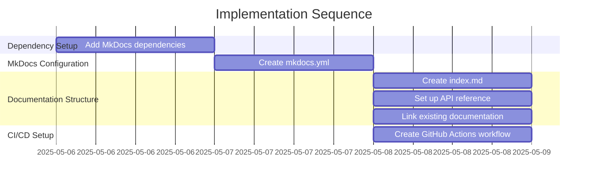

# Implementation Plan: MkDocs Setup

## 1. Overview

### 1.1 Component Purpose

Set up MkDocs for the pydapter project to provide comprehensive, well-structured
documentation that is easy to navigate and maintain. This includes configuring
MkDocs with the Material theme, setting up the directory structure, and creating
a GitHub Actions workflow for automatic deployment.

### 1.2 Design Reference

Issue #36: Set up MkDocs for project documentation.

### 1.3 Implementation Approach

The implementation follows a straightforward approach:

1. Add MkDocs and required plugins to project dependencies
2. Create MkDocs configuration file
3. Set up documentation directory structure
4. Create GitHub Actions workflow for deployment
5. Test the setup locally

## 2. Implementation Phases

### 2.1 Phase 1: Dependency Setup

**Key Deliverables:**

- Update pyproject.toml to include MkDocs and required plugins

**Dependencies:**

- None

**Estimated Complexity:** Low

### 2.2 Phase 2: MkDocs Configuration

**Key Deliverables:**

- Create mkdocs.yml configuration file
- Configure theme, plugins, and navigation

**Dependencies:**

- Phase 1

**Estimated Complexity:** Medium

### 2.3 Phase 3: Documentation Structure

**Key Deliverables:**

- Create index.md as the main landing page
- Set up API reference directory and placeholder files
- Link existing documentation files

**Dependencies:**

- Phase 2

**Estimated Complexity:** Medium

### 2.4 Phase 4: CI/CD Setup

**Key Deliverables:**

- Create GitHub Actions workflow for automatic deployment

**Dependencies:**

- Phase 3

**Estimated Complexity:** Low

## 3. Test Strategy

### 3.1 Unit Tests

Not applicable for documentation setup.

### 3.2 Integration Tests

#### 3.2.1 Test Group: Local Build

| ID   | Description                            | Setup                     | Assertions                                    |
| ---- | -------------------------------------- | ------------------------- | --------------------------------------------- |
| IT-1 | Test that MkDocs builds without errors | Run `uv run mkdocs build` | Command completes successfully without errors |
| IT-2 | Test that MkDocs serves without errors | Run `uv run mkdocs serve` | Local server starts without errors            |

## 4. Implementation Tasks

### 4.1 Dependency Setup

| ID  | Task                    | Description                                                  | Dependencies | Priority | Complexity |
| --- | ----------------------- | ------------------------------------------------------------ | ------------ | -------- | ---------- |
| T-1 | Add MkDocs dependencies | Update pyproject.toml to include MkDocs and required plugins | None         | High     | Low        |

### 4.2 MkDocs Configuration

| ID  | Task              | Description                          | Dependencies | Priority | Complexity |
| --- | ----------------- | ------------------------------------ | ------------ | -------- | ---------- |
| T-2 | Create mkdocs.yml | Create and configure mkdocs.yml file | T-1          | High     | Medium     |

### 4.3 Documentation Structure

| ID  | Task                        | Description                                                | Dependencies | Priority | Complexity |
| --- | --------------------------- | ---------------------------------------------------------- | ------------ | -------- | ---------- |
| T-3 | Create index.md             | Create main landing page                                   | T-2          | High     | Low        |
| T-4 | Set up API reference        | Create API reference directory and placeholder files       | T-2          | Medium   | Medium     |
| T-5 | Link existing documentation | Create symbolic links for CONTRIBUTING.md and CHANGELOG.md | T-2          | Medium   | Low        |

### 4.4 CI/CD Setup

| ID  | Task                           | Description                                   | Dependencies | Priority | Complexity |
| --- | ------------------------------ | --------------------------------------------- | ------------ | -------- | ---------- |
| T-6 | Create GitHub Actions workflow | Create workflow file for automatic deployment | T-2          | High     | Low        |

## 5. Implementation Sequence

## 6. Acceptance Criteria

### 6.1 Component Level

| ID   | Criterion                                          | Validation Method         |
| ---- | -------------------------------------------------- | ------------------------- |
| AC-1 | MkDocs builds successfully without errors          | Run `uv run mkdocs build` |
| AC-2 | Documentation is properly structured and navigable | Manual inspection         |
| AC-3 | GitHub Actions workflow is correctly configured    | Code review               |

## 7. Implementation Risks and Mitigations

| Risk                                        | Impact | Likelihood | Mitigation                                                      |
| ------------------------------------------- | ------ | ---------- | --------------------------------------------------------------- |
| Missing dependencies causing build failures | Medium | Low        | Ensure all required dependencies are included in pyproject.toml |
| Broken links in documentation               | Low    | Medium     | Test documentation locally before committing                    |

## 8. Dependencies and Environment

### 8.1 External Libraries

| Library              | Version | Purpose                           |
| -------------------- | ------- | --------------------------------- |
| mkdocs               | ^1.5.0  | Core documentation generator      |
| mkdocs-material      | ^9.5.0  | Material theme for MkDocs         |
| mkdocstrings[python] | ^0.24.0 | API documentation from docstrings |
| pymdown-extensions   | ^10.7.0 | Extended Markdown features        |
| mkdocs-autorefs      | ^0.5.0  | Automatic cross-references        |

## 9. Additional Resources

### 9.1 Reference Implementation

N/A

### 9.2 Relevant Documentation

- [MkDocs Documentation](https://www.mkdocs.org/)
- [MkDocs Material Theme Documentation](https://squidfunk.github.io/mkdocs-material/)
- [MkDocStrings Documentation](https://mkdocstrings.github.io/)

### 9.3 Design Patterns

N/A
