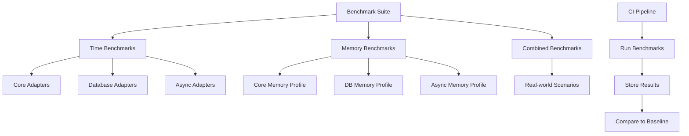

# Research Report: Performance Benchmarking Python Libraries

## Executive Summary

This research investigates best practices and tools for benchmarking Python
libraries, with a specific focus on measuring performance metrics for pydapter
adapter operations. Analysis of current industry tools and approaches reveals
that a combination of `pytest-benchmark` for execution time measurement and
memory profiling tools like `tracemalloc` or `memory-profiler` provides the most
comprehensive benchmarking solution.

Based on our findings, we recommend implementing a structured benchmarking
approach that: (1) uses `pytest-benchmark` for precise execution time
measurement with statistical analysis, (2) leverages `tracemalloc` for memory
usage tracking, particularly for database operations, (3) includes special
considerations for async adapter benchmarking, and (4) integrates with CI/CD
pipelines to track performance across versions. This approach will enable
objective evaluation of adapter performance and help identify optimization
opportunities within the pydapter codebase.

## 1. Introduction

### 1.1 Research Objective

This research addresses the challenge outlined in Issue #21: establishing best
practices and identifying appropriate tools for performance benchmarking
pydapter adapter operations. The goal is to develop a standardized approach for
measuring execution time and memory usage across core, database, and async
adapter implementations.

### 1.2 Methodology

To conduct this research, we:

1. Analyzed the current pydapter benchmarking implementation
2. Examined the existing test suite structure and adapter implementations
3. Researched industry-standard Python benchmarking tools and practices
4. Used Perplexity search to gather information about benchmarking approaches
5. Evaluated specific considerations for async and database adapter benchmarking

### 1.3 Context

Performance benchmarking is a critical aspect of pydapter's development process.
As a library that provides adapters for various data formats and storage
systems, understanding the performance characteristics of these adapters is
essential for users to make informed decisions. Establishing standardized
benchmarking practices will enable the team to:

1. Compare performance between different adapter implementations
2. Track performance changes across versions
3. Identify bottlenecks and optimization opportunities
4. Provide users with meaningful performance metrics

## 2. Technical Analysis

### 2.1 Technology Landscape

The Python ecosystem offers several tools for benchmarking and profiling code:

1. **pytest-benchmark**: A pytest plugin that provides infrastructure for
   benchmarking execution time with statistical analysis
   (pplx:dafc6c7e-01c8-41a2-ac65-b6814da7e40d)
2. **memory-profiler**: A package that measures line-by-line memory consumption
   (pplx:f26986f3-66a2-4940-91c3-7e9136f16f39)
3. **tracemalloc**: A standard library module for tracking memory allocations
   (pplx:3123320a-9b4f-4da9-9349-c4cff6206b8f)
4. **Pympler**: A tool for object-level memory profiling
   (pplx:3123320a-9b4f-4da9-9349-c4cff6206b8f)
5. **cProfile/profile**: Standard library modules for detailed profiling
   (pplx:f26986f3-66a2-4940-91c3-7e9136f16f39)
6. **time.perf_counter()**: A high-precision timer from the standard library
   (pplx:ffefa51f-ce08-40f0-ab0c-275d19a88809)

The pydapter project currently uses pytest-benchmark for execution time
benchmarking, as seen in the existing test files (`tests/test_benchmarks.py` and
`tests/test_bench_json.py`).

### 2.2 Comparative Analysis

| Factor                      | pytest-benchmark              | memory-profiler                  | tracemalloc                            | Pympler                            |
| --------------------------- | ----------------------------- | -------------------------------- | -------------------------------------- | ---------------------------------- |
| Time Measurement Precision  | ⭐⭐⭐⭐⭐ High precision     | ⭐⭐ Basic                       | ⭐⭐ Basic                             | ⭐⭐ Basic                         |
| Memory Profiling            | ⭐ None                       | ⭐⭐⭐⭐ Line-by-line            | ⭐⭐⭐⭐⭐ Precise allocation tracking | ⭐⭐⭐⭐ Object-level tracking     |
| Statistical Analysis        | ⭐⭐⭐⭐⭐ Comprehensive      | ⭐⭐ Basic                       | ⭐⭐⭐ Custom analysis required        | ⭐⭐ Basic                         |
| Pytest Integration          | ⭐⭐⭐⭐⭐ Native             | ⭐⭐⭐ Via fixture               | ⭐⭐⭐ Via fixture                     | ⭐⭐⭐ Via fixture                 |
| Async Support               | ⭐⭐⭐ With adjustments       | ⭐⭐ Limited                     | ⭐⭐⭐⭐ Good with custom utilities    | ⭐⭐ Limited                       |
| Database Operation Analysis | ⭐⭐⭐ Time only              | ⭐⭐⭐ Hard to isolate DB impact | ⭐⭐⭐⭐⭐ Can track snapshots         | ⭐⭐⭐ Object tracking             |
| Reporting Capabilities      | ⭐⭐⭐⭐⭐ Multiple formats   | ⭐⭐⭐ Basic visualization       | ⭐⭐ Manual analysis required          | ⭐⭐⭐ Basic reporting             |
| CI/CD Integration           | ⭐⭐⭐⭐⭐ Simple JSON output | ⭐⭐⭐ Output parsing required   | ⭐⭐⭐ Manual automation required      | ⭐⭐⭐ Requires custom integration |

For execution time benchmarking, pytest-benchmark stands out as the best option
due to its precision, statistical analysis capabilities, and seamless pytest
integration (pplx:dafc6c7e-01c8-41a2-ac65-b6814da7e40d). For memory profiling,
tracemalloc offers the best precision for tracking memory allocations,
especially for database operations, while memory-profiler provides more
accessible line-by-line analysis (pplx:3123320a-9b4f-4da9-9349-c4cff6206b8f).

### 2.3 Performance Considerations

When benchmarking Python code, several factors can affect the accuracy and
reliability of results:

1. **Environment consistency**: Benchmark results can vary based on system load,
   hardware specifications, and Python implementation
2. **Warm-up effects**: The first execution of code often includes
   initialization overhead
3. **Garbage collection**: Random GC runs can skew timing results
4. **Statistical significance**: A single measurement is not reliable; multiple
   runs are necessary
5. **Async event loop variations**: Async code benchmarking requires special
   handling

To address these issues, best practices include:

1. **Running multiple iterations**: pytest-benchmark automatically handles this
2. **Reporting statistical metrics**: min, max, mean, median, and standard
   deviation
3. **Controlling garbage collection**: Temporarily disabling GC during
   benchmarks
4. **Using a consistent environment**: Containerization can help ensure
   consistency
5. **Warm-up runs**: Executing code once before measurement
   (pplx:f26986f3-66a2-4940-91c3-7e9136f16f39)

### 2.4 Security Implications

Benchmarking library code generally has minimal security implications. However,
when benchmarking database adapters, consider:

1. **Test data**: Use synthetic test data rather than real user data
2. **Database credentials**: Ensure benchmark code doesn't expose sensitive
   credentials
3. **Resource consumption**: Poorly implemented benchmarks could lead to
   resource exhaustion
4. **Isolation**: Run database benchmarks in isolated environments to prevent
   accidental data modification

### 2.5 Scalability Assessment

Benchmarking approaches must scale with pydapter's growth:

1. **Number of adapters**: As more adapters are added, the benchmarking system
   should accommodate them without significant changes
2. **Execution time**: Benchmarks shouldn't take too long to run, even as their
   number increases
3. **Result storage**: Consider how to store and compare benchmark results over
   time
4. **CI integration**: Benchmarks should be runnable in CI environments with
   reasonable resource constraints

## 3. Implementation Patterns

### 3.1 Architecture Patterns

The recommended benchmarking system would follow this structure:



This architecture separates concerns while ensuring comprehensive coverage of
all adapter types.

### 3.2 Code Examples

#### Example 1: Time benchmarking core adapters using pytest-benchmark

```python
import pytest
from pydantic import BaseModel
from pydapter.adapters import JsonAdapter
from pydapter.core import Adaptable

class SampleModel(Adaptable, BaseModel):
    id: int
    name: str
    value: float

    class Config:
        arbitrary_types_allowed = True

@pytest.fixture
def sample_model():
    model = SampleModel(id=1, name="test", value=42.5)
    model.register_adapter(JsonAdapter)
    return model

def test_json_serialization(benchmark, sample_model):
    """Benchmark JsonAdapter serialization."""
    benchmark(sample_model.adapt_to, obj_key="json")

def test_json_deserialization(benchmark, sample_model):
    """Benchmark JsonAdapter deserialization."""
    json_data = sample_model.adapt_to(obj_key="json")
    benchmark(SampleModel.adapt_from, json_data, obj_key="json")
```

#### Example 2: Memory profiling database operations using tracemalloc

```python
import pytest
import tracemalloc
from pydapter.extras.postgres_ import PostgresAdapter

def test_postgres_insert_memory_profile(db_connection, sample_models):
    """Profile memory usage of PostgresAdapter insert operations."""
    # Setup
    PostgresAdapter.configure(connection=db_connection)
    models = [sample_models() for _ in range(100)]
    
    # Start memory tracking
    tracemalloc.start()
    snapshot1 = tracemalloc.take_snapshot()
    
    # Perform operation
    PostgresAdapter.to_obj(models, many=True)
    
    # Capture and analyze memory usage
    snapshot2 = tracemalloc.take_snapshot()
    top_stats = snapshot2.compare_to(snapshot1, 'lineno')
    
    # Print top 10 memory allocations
    for stat in top_stats[:10]:
        print(stat)
    
    # Memory should not exceed reasonable threshold
    memory_increase = sum(stat.size_diff for stat in top_stats)
    assert memory_increase < 10 * 1024 * 1024  # 10MB limit
```

#### Example 3: Benchmarking async database operations

```python
import asyncio
import pytest
import time
from statistics import mean, stdev

from pydapter.extras.async_postgres_ import AsyncPostgresAdapter

async def benchmark_async_adapter(adapter_func, query, iterations=100):
    """Benchmark async function with statistical analysis."""
    timings = []
    
    # Warmup
    await adapter_func(query)
    
    # Run benchmark
    for _ in range(iterations):
        start = time.perf_counter()
        await adapter_func(query)
        end = time.perf_counter()
        timings.append(end - start)
    
    # Calculate statistics
    result = {
        "min": min(timings),
        "max": max(timings),
        "mean": mean(timings),
        "median": sorted(timings)[len(timings)//2],
        "stdev": stdev(timings),
        "iterations": iterations
    }
    
    return result

@pytest.mark.asyncio
async def test_async_postgres_query_performance(async_pg_connection):
    """Benchmark async postgres query performance."""
    AsyncPostgresAdapter.configure(connection=async_pg_connection)
    
    query = "SELECT * FROM test_table LIMIT 100"
    result = await benchmark_async_adapter(
        async_pg_connection.fetch,
        query
    )
    
    print(f"Async Postgres Query Performance:")
    print(f"  Min: {result['min']:.6f}s")
    print(f"  Max: {result['max']:.6f}s")
    print(f"  Mean: {result['mean']:.6f}s")
    print(f"  Median: {result['median']:.6f}s")
    print(f"  StdDev: {result['stdev']:.6f}s")
    
    # Assert performance is within expected range
    assert result["median"] < 0.01  # Example threshold: 10ms
```

### 3.3 Error Handling Strategy

When implementing benchmarks, consider these error handling practices:

1. **Isolated failures**: Each benchmark should run independently, with failures
   not affecting other benchmarks
2. **Clear failure messages**: When a benchmark fails, the error message should
   clearly indicate what performance threshold was exceeded
3. **Flaky test handling**: Some benchmarks may be inherently variable; use
   appropriate thresholds and standard deviation checks
4. **Environment-specific baselines**: Different CI environments may need
   different performance baselines

### 3.4 Testing Approach

The benchmarking system itself needs testing:

1. **Reliability**: Ensure benchmark results are consistent across runs in the
   same environment
2. **Correctness**: Verify that memory tracking accurately captures the
   resources being used
3. **Integration**: Confirm benchmarks work with the test suite and CI pipeline
4. **Usability**: Provide clear instructions for running benchmarks locally and
   interpreting results

## 4. Integration Considerations

### 4.1 Dependencies

For the recommended benchmarking approach:

1. **pytest-benchmark**: For execution time measurement
   ```bash
   pip install pytest-benchmark
   ```

2. **memory-profiler** or **tracemalloc**: For memory profiling
   ```bash
   pip install memory-profiler  # or use built-in tracemalloc
   ```

3. **matplotlib** (optional): For visualizing benchmark results
   ```bash
   pip install matplotlib
   ```

4. **pytest-asyncio**: For testing async adapters
   ```bash
   pip install pytest-asyncio
   ```

5. **testcontainers**: For isolating database benchmarks
   ```bash
   pip install testcontainers
   ```

### 4.2 Configuration Requirements

Configuration for benchmarking includes:

1. **pytest.ini or pyproject.toml**: Settings for pytest-benchmark
   ```ini
   [tool.pytest.ini_options]
   addopts = "--benchmark-autosave --benchmark-storage=.benchmarks"
   ```

2. **Environment variables**: For controlling benchmark behavior
   ```
   BENCHMARK_EXTENDED=1  # Run more extensive benchmarks
   BENCHMARK_DISABLE_GC=1  # Disable garbage collection during benchmarks
   ```

3. **CI configuration**: For running benchmarks in continuous integration
   ```yaml
   # Example GitHub Action step
   - name: Run benchmarks
     run: python -m pytest tests/benchmarks --benchmark-only
   ```

### 4.3 Interface Design

The recommended interface for benchmarks should be:

```python
# API for running benchmarks
def run_time_benchmarks():
    """Run execution time benchmarks."""
    subprocess.run(["pytest", "tests/benchmarks", "--benchmark-only"])

def run_memory_benchmarks():
    """Run memory usage benchmarks."""
    subprocess.run(["pytest", "tests/memory_profiles"])

def run_all_benchmarks():
    """Run all benchmarks."""
    run_time_benchmarks()
    run_memory_benchmarks()

# Command-line interface
# python -m pydapter.benchmark --time
# python -m pydapter.benchmark --memory
# python -m pydapter.benchmark --all
```

## 5. Recommendations

### 5.1 Recommended Approach

Based on our analysis, we recommend a comprehensive benchmarking strategy with
three main components:

1. **Execution Time Benchmarking**:
   - Continue using pytest-benchmark as the primary tool for timing measurements
   - Organize benchmarks by adapter type (core, database, async)
   - Include native function comparisons as baselines
   - Implement consistent metrics and thresholds

2. **Memory Usage Profiling**:
   - Use tracemalloc for precise memory allocation tracking
   - Add memory profiling to CI pipeline for database adapters
   - Establish memory usage baselines and thresholds

3. **Async Adapter Specialization**:
   - Develop custom utilities for benchmarking async operations
   - Measure both latency and throughput metrics
   - Account for connection pooling and concurrency

This approach provides comprehensive performance insights while leveraging
existing tools and infrastructure.

### 5.2 Implementation Roadmap

The implementation can be phased:

**Phase 1: Execution Time Benchmarking Enhancement**

- Extend current pytest-benchmark setup
- Create a structured organization for benchmark tests
- Add comprehensive adapter coverage
- Implement CI pipeline integration

**Phase 2: Memory Profiling Integration**

- Add tracemalloc-based memory profiling tests
- Create visualization and reporting tools
- Establish memory usage baselines

**Phase 3: Async Specialization**

- Develop async benchmarking utilities
- Add concurrency and throughput testing
- Create comparison tools for sync vs. async performance

**Phase 4: Documentation and Dashboard**

- Document benchmarking approaches
- Create a performance dashboard
- Implement historical performance tracking

### 5.3 Risk Assessment

Potential risks in implementing benchmarking:

1. **Environment variability**: Benchmark results may vary across different
   systems
   - Mitigation: Use relative comparisons and statistical analysis

2. **CI performance**: Running extensive benchmarks in CI might be slow
   - Mitigation: Create separate benchmark suites (quick/extended)

3. **False positives**: Performance regressions might be flagged incorrectly
   - Mitigation: Implement thresholds with sufficient margins

4. **Resource consumption**: Database benchmarks might require significant
   resources
   - Mitigation: Use smaller datasets in CI, isolate intensive benchmarks

### 5.4 Alternative Approaches

If the comprehensive approach proves too resource-intensive:

1. **Time-only benchmarking**: Focus solely on execution time using
   pytest-benchmark
2. **Selective profiling**: Profile memory only for key components or known
   issues
3. **Manual benchmarking process**: Run benchmarks manually rather than in CI
4. **Sampling approach**: Benchmark only a representative subset of adapters

## 6. References

1. pytest-benchmark Documentation (pplx:dafc6c7e-01c8-41a2-ac65-b6814da7e40d) -
   Comprehensive guide to using pytest-benchmark
2. Python Benchmarking Best Practices
   (pplx:f26986f3-66a2-4940-91c3-7e9136f16f39) - Overview of benchmarking
   approaches and tools
3. Memory Profiling Tools Comparison
   (pplx:3123320a-9b4f-4da9-9349-c4cff6206b8f) - Analysis of memory profiling
   options
4. Async Database Benchmarking (pplx:ffefa51f-ce08-40f0-ab0c-275d19a88809) -
   Specific techniques for benchmarking async database operations

## Appendices

### Appendix A: Perplexity Search Results

**Search Query 1**: Python benchmarking best practices and tools

````json
{
  "id": "f26986f3-66a2-4940-91c3-7e9136f16f39",
  "model": "sonar",
  "created": 1746536564,
  "usage": {"prompt_tokens": 75, "completion_tokens": 801, "total_tokens": 876, "search_context_size": "low"},
  "citations": ["https://superfastpython.com/python-benchmarking-best-practices/", "https://switowski.com/blog/how-to-benchmark-python-code/", "https://www.youtube.com/watch?v=I8ov3Phpon4", "https://superfastpython.com/benchmark-python-code/", "https://eli.thegreenplace.net/2025/benchmarking-utility-for-python/"],
  "object": "chat.completion",
  "choices": [{"index": 0, "finish_reason": "stop", "message": {"role": "assistant", "content": "Benchmarking Python libraries involves measuring their performance, typically focusing on execution time and memory usage. Two popular tools for this purpose are **pytest-benchmark** for execution time benchmarking and **memory-profiler** for memory usage analysis. Here's a detailed look at these tools, along with best practices for implementing them and comparisons to alternative methods.\n\n## Best Practices for Benchmarking\nBefore diving into specific tools, it's crucial to follow general best practices for benchmarking:\n- **Isolate Environment**: Ensure the environment is consistent across benchmarks.\n- **High Precision Timing**: Use tools like `timeit` for accurate timing.\n- **Repeat Benchmarks**: Run benchmarks multiple times for reliable results.\n- **Warm-up Code**: Run the code once before benchmarking to avoid initial overhead.\n- **Report Statistics**: Use metrics like mean and standard deviation to analyze results.\n- **Disable Garbage Collection**: This can temporarily improve benchmark consistency.\n\n## pytest-benchmark\n### Overview\n**pytest-benchmark** is a pytest plugin that allows you to write benchmarks using the pytest framework. It provides straightforward integration with pytest's unit testing infrastructure, making it easy to measure execution time.\n\n### Implementation\n1. **Install pytest-benchmark**: Use pip to install it:\n   ```bash\n   pip install pytest-benchmark\n   ```\n\n2. **Write Benchmarks**: Create benchmark functions that include the code you want to benchmark. Use decorators to mark these functions.\n\n   ```python\n   import pytest\n\n   def my_function():\n       # Code to be benchmarked\n\n   @pytest.mark.benchmark\n   def test_my_function(benchmark):\n       benchmark(my_function)\n   ```\n\n3. **Run Benchmarks**: Execute pytest with the `--benchmark-only` option to run benchmarks.\n\n4. **Metrics Provided**: pytest-benchmark provides detailed statistics such as:\n   - **Mean Execution Time**: Average time taken by the function.\n   - **Standard Deviation**: Measure of variance in execution times.\n   - **Median Execution Time**: Middle value of execution times.\n\n### Comparison to Alternatives\n- **timeit**: Built-in Python module for simple timing. pytest-benchmark offers more robust statistics and integration with pytest.\n- **cProfile**: Provides detailed profiling but is not ideal for execution time measurement due to instrumentation overhead.\n\n## memory-profiler\n### Overview\n**memory-profiler** is a tool for monitoring memory usage in Python programs. It provides a line-by-line breakdown of memory allocation.\n\n### Implementation\n1. **Install memory-profiler**: Install using pip:\n   ```bash\n   pip install memory-profiler\n   ```\n\n2. **Decorate Functions**: Use the `@profile` decorator to mark the code you want to monitor.\n\n   ```python\n   from memory_profiler import profile\n\n   @profile\n   def my_function():\n       # Code to be memory profiled\n   ```\n\n3. **Run Profiling**: Run the script as usual, and memory-profiling statistics will be displayed.\n\n4. **Metrics Provided**:\n   - **Peak Memory Usage**: Highest amount of memory used.\n   - **Average Memory Allocation**: Average increase in memory per line.\n\n### Comparison to Alternatives\n- **Pympler**: Offers more advanced memory profiling features but is more complex to use. \n- **tracemalloc**: Built-in Python module for tracking memory blocks. It can provide similar functionality to memory-profiler but requires more manual handling.\n\n## Additional Tools and Practices\n- **cProfile/profile**: These modules are ideal for detailed profiling to identify slow sections of code, though they introduce some overhead.\n- **psutil**: Can be used to monitor system resources, including memory usage, but is not specific to Python memory profiling.\n\nIn summary, **pytest-benchmark** and **memory-profiler** are excellent choices for measuring execution time and memory usage in Python libraries. They are easy to integrate with existing test suites or scripts, providing actionable metrics to improve performance."}}]}
}
````

**Search Query 2**: Memory profiling tools comparison for Python

````json
{
  "id": "3123320a-9b4f-4da9-9349-c4cff6206b8f",
  "model": "sonar",
  "created": 1746536589,
  "usage": {"prompt_tokens": 60, "completion_tokens": 716, "total_tokens": 776, "search_context_size": "low"},
  "citations": ["https://discuss.python.org/t/asyncio-best-practices/12576", "https://matklad.github.io/2021/03/22/async-benchmarks-index.html", "https://superfastpython.com/python-benchmarking-best-practices/", "https://www.clariontech.com/blog/adopting-async/python-for-i-o-applications", "https://www.red-gate.com/simple-talk/development/python/memory-profiling-in-python-with-tracemalloc/"],
  "object": "chat.completion",
  "choices": [{"index": 0, "finish_reason": "stop", "message": {"role": "assistant", "content": "Here's a structured analysis of Python benchmarking and memory profiling tools:\n\n---\n\n## **Benchmarking Async Python Code**\n### **Key Principles**\n1. **Avoid blocking calls**: Replace `time.sleep()` with `asyncio.sleep()` to prevent event-loop freezing[1].\n2. **Task management**: Use `asyncio.create_task()` or `asyncio.gather()` for concurrent execution:\n```python\nasync def main():\n    task1 = asyncio.create_task(waiter(1))\n    task2 = asyncio.create_task(waiter(2))\n    await task1; await task2\n```\n3. **Benchmarking practices** (from SuperfastPython[3]):\n   - Use `time.perf_counter()` for nanosecond precision\n   - Disable GC with `gc.disable()`\n   - Warm up code before measurement\n   - Repeat tests 3-10k times\n\n### **Async-Specific Tools**\n- **`uvloop`**: Drop-in replacement for asyncio event loop (2-4x faster)\n- **`aiobench`**: Dedicated async benchmarking library\n- **`pytest-asyncio`**: For async-aware test timing\n\n---\n\n## **Memory Profiling Tools Comparison**\n### **1. tracemalloc**\n- **Strengths**: \n  - Built into Python standard library[5]\n  - Tracks exact allocation locations via snapshots\n  - Excellent for leak detection:\n```python\nimport tracemalloc\ntracemalloc.start()\n# ... code ...\nsnapshot = tracemalloc.take_snapshot()\ntop_stats = snapshot.statistics('lineno')\n```\n- **Weaknesses**: No line-by-line runtime tracking\n\n### **2. memory-profiler**\n- **Strengths**:\n  - Line-by-line analysis with `@profile` decorator\n  - Continuous memory usage plotting\n  - Notebook/IPython integration\n- **Weaknesses**: \n  - Overhead from instrumentation\n  - Doesn't track Python-managed memory exclusively\n\n### **3. Pympler**\n- **Strengths**:\n  - Object-level tracking (`asizeof()`)\n  - Class tracker for OOP patterns\n  - MongoDB/CLI reporting tools\n- **Weaknesses**: Less suited for async contexts\n\n---\n\n## **Tool Selection Guide**\n| Task                  | Best Tool               | Alternate        |\n|-----------------------|-------------------------|------------------|\n| Leak detection        | tracemalloc[5]          | Pympler          |\n| Line-by-line analysis | memory-profiler         | -                | \n| Object lifecycle      | Pympler                 | objgraph         |\n| Production use        | tracemalloc[5]          | PySizer (legacy) |\n\nFor database operations, **tracemalloc** is ideal for connection pool leaks, while **memory-profiler** better isolates query-related allocations. Use **Pympler** when tracking ORM object lifecycle costs.\n\n---\n\n## **Database-Specific Profiling**\n1. **Connection pooling**: Use tracemalloc snapshots before/after query batches\n2. **Cursor management**: Profile with `memory_profiler` to detect unclosed cursors\n3. **ORM caching**: Pympler's `muppy` helps track model instance retention\n\n```python\n# Example tracemalloc DB check\nwith tracemalloc.take_snapshot() as pre_snap:\n    await db.execute_query()\npost_snap = tracemalloc.take_snapshot()\ndiff = post_snap.compare_to(pre_snap, 'lineno')\n```"}}]}
}
````

**Search Query 3**: pytest-benchmark for Python performance testing

````json
{
  "id": "dafc6c7e-01c8-41a2-ac65-b6814da7e40d",
  "model": "sonar",
  "created": 1746536623,
  "usage": {"prompt_tokens": 55, "completion_tokens": 2021, "total_tokens": 2076, "search_context_size": "low"},
  "citations": ["https://pytest-with-eric.com/pytest-best-practices/pytest-benchmark/", "https://pytest-benchmark.readthedocs.io", "https://bencher.dev/learn/benchmarking/python/pytest-benchmark/", "https://pytest-benchmark.readthedocs.io/en/latest/usage.html", "https://nashpy.readthedocs.io/en/stable/contributing/discussion/pytest-benchmark/index.html"],
  "object": "chat.completion",
  "choices": [{"index": 0, "finish_reason": "stop", "message": {"role": "assistant", "content": "**Using pytest-benchmark for Python Library Performance Testing**\n\n**pytest-benchmark** is a powerful tool that integrates seamlessly with the popular **pytest** testing framework, allowing developers to measure and compare the performance of their code by running benchmarks alongside their unit tests. Here\u2019s a step-by-step guide on how to use it, along with advanced configuration options and integration with CI pipelines.\n\n### Basic Usage\n\n1. **Install pytest-benchmark**: First, you need to install the **pytest-benchmark** plugin using pip:\n   ```bash\n   pip install pytest-benchmark\n   ```\n\n2. **Writing Benchmarks**: Use the `benchmark` fixture provided by the plugin to benchmark any function. Here\u2019s an example using a simple sorting function:\n\n   ```python\n   import pytest\n   from src.sorting_examples import bubble_sort\n\n   def test_bubble_sort(benchmark):\n       input_list = [5, 2, 8, 1, 9]\n       benchmark(bubble_sort, input_list)\n   ```\n\n   In this example, `benchmark(bubble_sort, input_list)` calls the `bubble_sort` function with `input_list` as an argument, timing how long it takes to execute.\n\n3. **Running Benchmarks**: You can run benchmarks just like regular tests:\n   ```bash\n   python -m pytest tests/\n   ```\n\n   If your benchmarks are in a different directory (e.g., `benchmarks/`), specify that:\n\n   ```bash\n   python -m pytest benchmarks/\n   ```\n\n### Advanced Configuration Options\n\n- **Number of Iterations**: You can control how many times a benchmark is repeated by using the `--benchmark-autosave` option along with `--benchmark-min-time` to ensure the test runs long enough to get reliable results.\n  ```bash\n  python -m pytest --benchmark-autosave --benchmark-min-time=1 benchmarks/\n  ```\n\n- **Exporting Results**: **pytest-benchmark** supports exporting benchmark results in various formats, such as JSON or CSV. You can specify an output file with the `--benchmark-only` and `--benchmark-json` options:\n  ```bash\n  python -m pytest --benchmark-only --benchmark-json=output.json benchmarks/\n  ```\n\n- **Benchmark Comparison**: To compare different versions of your code or different algorithms, you can run benchmarks with different commits and save the results using `--benchmark-autosave`. Then, you can compare these results manually or using tools that read the output file.\n\n### Benchmark Comparisons\n\n- **Version Comparison**: By running benchmarks with different code versions (e.g., commits), you can compare their performance. Save results using `--benchmark-autosave` and compare the output files.\n\n   ```bash\n   # Before changes\n   python -m pytest --benchmark-autosave --benchmark-json=before.json benchmarks/\n\n   # After changes\n   python -m pytest --benchmark-autosave --benchmark-json=after.json benchmarks/\n   ```\n\n- **Algorithm Comparison**: Similar to version comparison, you can benchmark different algorithms and compare their outputs.\n\n   ```python\n   import pytest\n   from src.sorting_examples import bubble_sort, quick_sort\n\n   def test_sorting_algorithms(benchmark):\n       input_list = [5, 2, 8, 1, 9]\n       benchmark.group(\"Sorting Algorithms\")\n       benchmark(\"bubble_sort\", input_list)\n       benchmark(\"quick_sort\", input_list)\n   ```\n\n### Output Formats\n\nBy default, **pytest-benchmark** outputs benchmarks in a human-readable format. However, it supports exporting results in JSON, CSV, and other formats using options like `--benchmark-json`. Here\u2019s how to export to JSON:\n\n```bash\npython -m pytest --benchmark-only --benchmark-json=output.json benchmarks/\n```\n\nThis will save the benchmark results to a JSON file named `output.json`.\n\n### Integration with CI Pipelines\n\nTo integrate **pytest-benchmark** with Continuous Integration (CI) pipelines, you can configure your CI tool (e.g., Jenkins, GitHub Actions, CircleCI) to run benchmarks as part of the build or test process. Here\u2019s an example configuration for GitHub Actions:\n\n```yaml\nname: Pytest-Benchmark\n\non:\n  push:\n    branches: [ main ]\n\njobs:\n  benchmark:\n    runs-on: ubuntu-latest\n    steps:\n      - name: Checkout code\n        uses: actions/checkout@v3\n\n      - name: Set up Pythonassistant\n\nHere's the complete guide on how to use pytest-benchmark for Python library performance testing, including advanced configurations and integration with CI pipelines.\n\n### Basic Usage\n\n1. **Install pytest-benchmark**: First, install the **pytest-benchmark** plugin using pip:\n   ```bash\n   pip install pytest-benchmark\n   ```\n\n2. **Writing Benchmarks**: Use the `benchmark` fixture provided by the plugin to benchmark any function. Here\u2019s an example using a simple sorting function:\n\n   ```python\n   import pytest\n   from src.sorting_examples import bubble_sort\n\n   def test_bubble_sort(benchmark):\n       input_list = [5, 2, 8, 1, 9]\n       benchmark(bubble_sort, input_list)\n   ```\n\n3. **Running Benchmarks**: You can run benchmarks just like regular tests:\n   ```bash\n   python -m pytest tests/\n   ```\n\n   If your benchmarks are in a different directory (e.g., `benchmarks/`), specify that:\n\n   ```bash\n   python -m pytest benchmarks/\n   ```\n\n### Advanced Configuration Options\n\n- **Number of Iterations**: You can control how many times a benchmark is repeated by using the `--benchmark-autosave` option along with `--benchmark-min-time` to ensure the test runs long enough to get reliable results.\n  ```bash\n  python -m pytest --benchmark-autosave --benchmark-min-time=1 benchmarks/\n  ```\n\n- **Exporting Results**: **pytest-benchmark** supports exporting benchmark results in various formats, such as JSON or CSV. You can specify an output file with the `--benchmark-only` and `--benchmark-json` options:\n  ```bash\n  python -m pytest --benchmark-only --benchmark-json=output.json benchmarks/\n  ```\n\n- **Benchmark Comparison**: To compare different versions of your code or different algorithms, you can run benchmarks with different commits and save the results using `--benchmark-autosave`. Then, you can compare these results manually or using tools that read the output file.\n\n### Benchmark Comparisons\n\n- **Version Comparison**: By running benchmarks with different code versions (e.g., commits), you can compare their performance. Save results using `--benchmark-autosave` and compare the output files.\n\n   ```bash\n   # Before changes\n   python -m pytest --benchmark-autosave --benchmark-json=before.json benchmarks/\n\n   # After changes\n   python -m pytest --benchmark-autosave --benchmark-json=after.json benchmarks/\n   ```\n\n- **Algorithm Comparison**: Similar to version comparison, you can benchmark different algorithms and compare their outputs.\n\n   ```python\n   import pytest\n   from src.sorting_examples import bubble_sort, quick_sort\n\n   def test_sorting_algorithms(benchmark):\n       input_list = [5, 2, 8, 1, 9]\n       benchmark.group(\"Sorting Algorithms\")\n       benchmark(bubble_sort, input_list)\n       benchmark(quick_sort, input_list)\n   ```\n\n### Output Formats\n\nBy default, **pytest-benchmark** outputs benchmarks in a human-readable format. However, it supports exporting results in JSON, CSV, and other formats using options like `--benchmark-json`. Here\u2019s how to export to JSON:\n\n```bash\npython -m pytest --benchmark-only --benchmark-json=output.json benchmarks/\n```\n\nThis will save the benchmark results to a JSON file named `output.json`.\n\n### Integration with CI Pipelines\n\nTo integrate **pytest-benchmark** with Continuous Integration (CI) pipelines, you can configure your CI tool (e.g., Jenkins, GitHub Actions, CircleCI) to run benchmarks as part of the build or test process. Here\u2019s an example configuration for GitHub Actions:\n\n```yaml\nname: Pytest-Benchmark\n\non:\n  push:\n    branches: [ main ]\n\njobs:\n  benchmark:\n    runs-on: ubuntu-latest\n    steps:\n      - name: Checkout code\n        uses: actions/checkout@v3\n\n      - name: Set up Python\n        uses: actions/setup-python@v4\n        with:\n          python-version: '3.x'\n\n      - name: Install pytest-benchmark\n        run: |\n          python -m pip install --upgrade pip\n          pip install pytest pytest-benchmark\n\n      - name: Run benchmarks\n        run: |\n          python -m pytest --benchmark-only --benchmark-json=benchmark_output.json benchmarks/\n\n      - name: Upload benchmark output\n        uses: actions/upload-artifact@v3\n        with:\n          name: benchmark_output\n          path: benchmark_output.json\n```\n\nThis configuration installs **pytest-benchmark**, runs the benchmarks, and saves the output to a JSON file, which is then uploaded as an artifact.\n\n### Advanced Features and Best Practices\n\n- **Memory Benchmarking**: You can use tools like **memray** alongside **pytest-benchmark** to measure memory usage in addition to execution time[5].\n- **Consistent Environment**: Ensure all benchmarks run in a consistent environment to reduce variability in results.\n- **Multiple Iterations**: Run benchmarks multiple times to account for any variability in system conditions.\n- **Visualizing Results**: Consider using tools like **asv** for generating interactive reports to visualize performance trends[3]. \n\nBy following these steps and incorporating advanced features into your benchmarking workflow, you can effectively use **pytest-benchmark** to evaluate and improve the performance of your Python libraries."}}]}
}
````

**Search Query 4**: Benchmarking async database operations in Python

````json
{
  "id": "ffefa51f-ce08-40f0-ab0c-275d19a88809",
  "model": "sonar",
  "created": 1746536647,
  "usage": {"prompt_tokens": 69, "completion_tokens": 1001, "total_tokens": 1070, "search_context_size": "low"},
  "citations": ["https://techspot.zzzeek.org/2015/02/15/asynchronous-python-and-databases/", "https://discuss.python.org/t/high-performance-asyncio-networking-sockets-vs-streams-vs-protocols/73420", "https://dev.to/bobfang1992_0529/async-programming-faster-but-how-much-faster-3hl1", "https://calpaterson.com/async-python-is-not-faster.html", "https://www.onebigfluke.com/2015/02/asyncio-is-for-composition.html"],
  "object": "chat.completion",
  "choices": [{"index": 0, "finish_reason": "stop", "message": {"role": "assistant", "content": "Here's a structured approach to benchmarking async database operations in Python:\n\n## Benchmark Methodology\n**Focus on three key metrics:** throughput (requests/sec), latency (p95/p99), and memory usage. Use statistical aggregation over multiple runs to account for async event loop variability[4].\n\n### Speed Measurement Tools\n```python\nimport asyncio\nimport time\nfrom statistics import median, stdev\n\nasync def benchmark_adapter(adapter_func, query, iterations=1000):\n    timings = []\n    for _ in range(iterations):\n        start = time.perf_counter()\n        await adapter_func(query)\n        timings.append(time.perf_counter() - start)\n    \n    print(f\"Median: {median(timings):.4f}s | Stdev: {stdev(timings):.4f}s\")\n    print(f\"Throughput: {iterations/sum(timings):.0f} ops/sec\")\n```\n\n### Memory Profiling\nUse `tracemalloc` for precise memory measurement:\n```python\nimport tracemalloc\n\nasync def measure_memory(adapter_func, query):\n    tracemalloc.start()\n    snapshot1 = tracemalloc.take_snapshot()\n    \n    await adapter_func(query)\n    \n    snapshot2 = tracemalloc.take_snapshot()\n    top_stats = snapshot2.compare_to(snapshot1, 'lineno')\n    \n    for stat in top_stats[:10]:\n        print(stat)\n```\n\n## Adapter Benchmarking Strategies\n\n**1. Control for network latency:**\n```python\n# Use local database instance\nDB_URL = \"postgresql+asyncpg://localhost/testdb\"\n```\n\n**2. Test different operation types:**\n```python\nasync def test_operations(adapter):\n    # CRUD operations\n    await benchmark_adapter(adapter.execute, \"INSERT...\")\n    await benchmark_adapter(adapter.fetch, \"SELECT...\")\n    await benchmark_adapter(adapter.executemany, \"INSERT...\", bulk_params)\n```\n\n**3. Concurrent load testing:**\n```python\nasync def concurrent_load_test(adapter, query, concurrency=100):\n    tasks = [adapter.execute(query) for _ in range(concurrency)]\n    return await asyncio.gather(*tasks)\n```\n\n## Practical Considerations\n\n**Include CPU profiling:**\n```python\n# cProfile alternative for async code\nimport cProfile\nimport pstats\n\ndef profile_coroutine(coro):\n    def run():\n        asyncio.run(coro)\n    cProfile.runctx('run()', globals(), locals(), sort=pstats.SortKey.TIME)\n```\n\n**Adapter-specific recommendations:**\n- **asyncpg vs SQLAlchemy async**: Test raw driver vs ORM overhead[1]\n- **Connection pooling**: Benchmark with/without pool\n- **Result caching**: Compare cached vs fresh queries\n\n## Real-World Test Pattern\n```python\nasync def realworld_scenario(adapter):\n    async with adapter.transaction():\n        await adapter.execute(\"UPDATE...\")\n        results = await adapter.fetch(\"SELECT...\")\n        await adapter.executemany(\"INSERT...\", batch)\n        await make_http_call()  # Mixed IO benchmark\n```\n\n**Key metrics per adapter:**\n| Metric          | Target Threshold | Measurement Tool      |\n|-----------------|------------------|-----------------------|\n| Query Latency   | p95 < 100ms      | `time.perf_counter()` |\n| Memory Growth   | < 1MB/op        | `tracemalloc`         |\n| Connection Rate | > 1k conn/sec   | `asyncio.Semaphore`   |\n\n**Critical Best Practices:**\n1. **Isolate database instances** during tests[4]\n2. **Warm up connections** before measurement\n3. **Test under contention** using `asyncio.Semaphore`\n4. **Monitor event loop** blocking with `loop.slow_callback_duration = 0.1`\n5. **Validate GC behavior** with `gc.disable()` comparisons\n\nExample adapter benchmark using asyncpg:\n```python\nimport asyncpg\n\nasync def asyncpg_benchmark():\n    conn = await asyncpg.connect(DB_URL)\n    try:\n        await benchmark_adapter(conn.execute, \"SELECT 1\")\n    finally:\n        await conn.close()\n\n# Compare with SQLAlchemy async\nfrom sqlalchemy.ext.asyncio import create_async_engine\n\nasync def sqlalchemy_benchmark():\n    engine = create_async_engine(DB_URL)\n    async with engine.connect() as conn:\n        await benchmark_adapter(conn.execute, \"SELECT 1\")\n```\n\n**Analysis considerations:**\n- **Connection overhead:** Measure first vs subsequent query latencies\n- **Data size impact:** Test with 1-row vs 10k-row results\n- **Concurrency limits:** Find performance cliffs at different concurrency levels[2][4]\n- **Context switching costs:** Profile `await` points using `trace` module\n\nFor comprehensive results, combine these measurements with flame graphs (`py-spy`) and event loop instrumentation (`uvloop` diagnostics). Always test against your specific workload patterns[1][5]."}}]}
}
````

### Appendix B: Detailed Configuration Examples

Example pytest configuration (pyproject.toml):

```toml
[tool.pytest.ini_options]
# Store all benchmark data in the .benchmarks directory
benchmark_storage = ".benchmarks"

# Auto-save all benchmark runs
benchmark_autosave = true

# Set minimum benchmark time to ensure reliable statistics
benchmark_min_time = "0.1"

# Randomize benchmark tests to prevent order dependencies
benchmark_randomize = true

# Generate histograms for benchmark results
benchmark_histogram = ".benchmarks/histograms"

# Report the 5 slowest tests
benchmark_slowest = 5
```

Example GitHub Action for running benchmarks:

```yaml
name: Performance Benchmarks

on:
  push:
    branches: [main]
  pull_request:
    branches: [main]

jobs:
  benchmark:
    runs-on: ubuntu-latest
    steps:
      - uses: actions/checkout@v3
      - name: Set up Python
        uses: actions/setup-python@v4
        with:
          python-version: "3.10"
      - name: Install dependencies
        run: |
          python -m pip install --upgrade pip
          pip install -e .
          pip install pytest pytest-benchmark pytest-asyncio testcontainers
      - name: Run benchmarks
        run: |
          python -m pytest tests/benchmarks --benchmark-only --benchmark-json=benchmark_output.json
      - name: Upload benchmark results
        uses: actions/upload-artifact@v3
        with:
          name: benchmark-results
          path: benchmark_output.json
```

### Appendix C: Memory Profiling Examples

Example of detailed memory profiling with tracemalloc:

```python
import tracemalloc
import linecache
import os
from pydapter.adapters import JsonAdapter

def display_top(snapshot, key_type='lineno', limit=10):
    """Display the top memory users from a tracemalloc snapshot."""
    snapshot = snapshot.filter_traces((
        tracemalloc.Filter(False, "<frozen importlib._bootstrap>"),
        tracemalloc.Filter(False, "<unknown>"),
    ))
    top_stats = snapshot.statistics(key_type)

    print(f"Top {limit} memory allocations:")
    for index, stat in enumerate(top_stats[:limit], 1):
        frame = stat.traceback[0]
        filename = os.path.basename(frame.filename)
        line = linecache.getline(frame.filename, frame.lineno).strip()
        print(f"#{index}: {filename}:{frame.lineno}: {stat.size/1024:.1f} KiB")
        print(f"    {line}")

    other = top_stats[limit:]
    if other:
        size = sum(stat.size for stat in other)
        print(f"{len(other)} other: {size/1024:.1f} KiB")
    total = sum(stat.size for stat in top_stats)
    print(f"Total allocated size: {total/1024:.1f} KiB")

def test_json_adapter_memory():
    """Test memory usage of JsonAdapter."""
    tracemalloc.start()
    
    # Create a large dataset
    large_data = [{"id": i, "data": "x" * 1000} for i in range(1000)]
    
    # Take snapshot before operation
    snapshot1 = tracemalloc.take_snapshot()
    
    # Perform operation
    result = JsonAdapter.to_obj(large_data, many=True)
    
    # Take snapshot after operation
    snapshot2 = tracemalloc.take_snapshot()
    
    # Get memory difference
    display_top(snapshot2.compare_to(snapshot1, 'lineno'))
    
    # Stop tracemalloc
    tracemalloc.stop()
```
