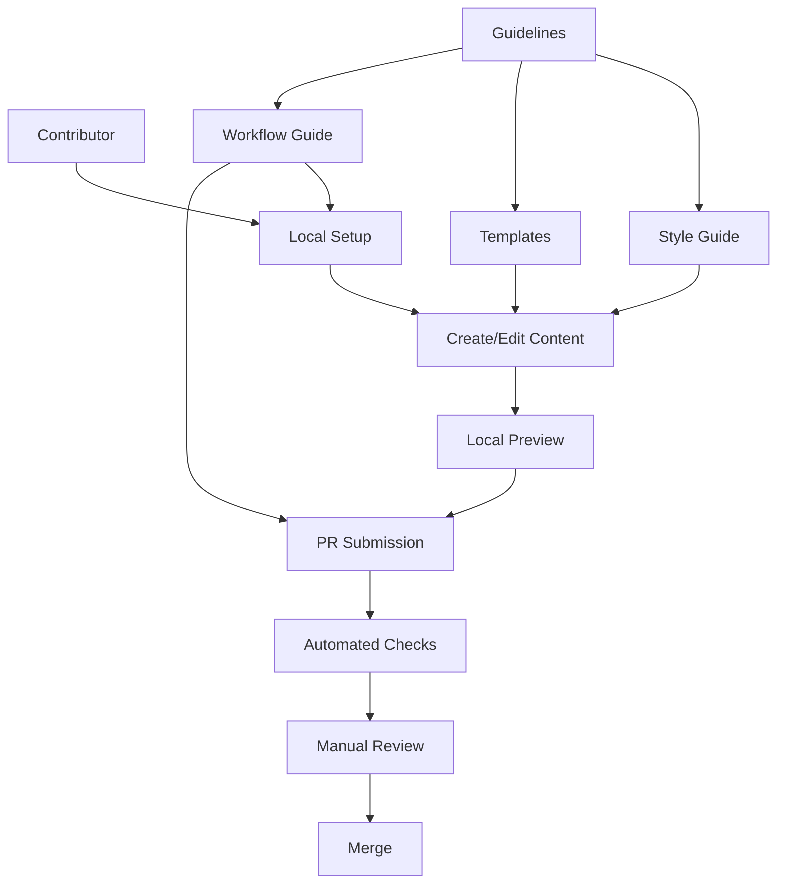

# Research Report: Documentation Contribution Guidelines

## Executive Summary

This research report examines best practices for documentation contribution
guidelines in open-source Python libraries, with a specific focus on
MkDocs-based documentation systems like the one used by pydapter. Analysis of
similar projects like FastAPI, SQLAlchemy, and Pydantic reveals that successful
documentation contribution guidelines include clear style specifications,
well-defined workflow processes, and standardized templates.

Based on our analysis, we recommend implementing a comprehensive documentation
contribution guide that includes: (1) structured guidelines for different
documentation types, (2) a consistent style guide with specific formatting
rules, (3) a clear contribution workflow with local setup instructions, and (4)
templates for common documentation components. This approach will ensure
documentation consistency and lower the barrier to entry for new contributors
while aligning with pydapter's "consistency beats cleverness" philosophy.

## 1. Introduction

### 1.1 Research Objective

This research addresses the challenge outlined in Issue #41: creating clear
guidelines for contributing to pydapter's documentation, including style
guidelines, workflow processes, and best practices. The goal is to ensure
consistency across documentation and make it easier for new contributors to help
improve the docs.

### 1.2 Methodology

To conduct this research, we:

1. Analyzed the current pydapter documentation structure
2. Examined existing contribution practices in the project
3. Studied documentation contribution guidelines from similar Python libraries
   (FastAPI, SQLAlchemy, Pydantic)
4. Researched industry best practices for MkDocs-based documentation systems
5. Used Perplexity search to gather information about documentation best
   practices

### 1.3 Context

Documentation is a critical aspect of pydapter's usability and adoption. As
stated in Issue #41, according to the "pydapter Developer Style Guide,"
consistency beats cleverness. This principle should extend to documentation as
well. Clear contribution guidelines will ensure all documentation follows the
same standards and style, making it easier for users to navigate and understand
the library.

## 2. Technical Analysis

### 2.1 Technology Landscape

The pydapter project currently uses MkDocs with the Material theme for
documentation, as evidenced by the `mkdocs.yml` configuration file. This setup
provides several advantages:

1. **Markdown-based content**: Easier to write and maintain than more complex
   formats (pplx:a072c5e5-d5f9-42f3-a541-8b6b5c77b977)
2. **Material design components**: Admonitions, code blocks with syntax
   highlighting, content tabs, etc.
3. **Integration with Python docstrings**: Via mkdocstrings plugin
4. **Navigation flexibility**: Customizable sidebar and automatic table of
   contents

Several patterns emerged from examining similar projects:

- **FastAPI**: Uses a clear contribution workflow with conventional commits and
  emphasis on metadata standards (pplx:54664140-abd3-4299-9f75-555acf50071a)
- **Pydantic**: Focuses on friendly, approachable documentation with
  Google-style docstrings (pplx:5ba8ceeb-f75f-4960-a7b5-974b8cb25c64)
- **SQLAlchemy**: Employs Sphinx with reStructuredText, emphasizing detailed API
  documentation (pplx:d38b4ea1-1b27-4283-ab72-9c5771270e78)

### 2.2 Comparative Analysis

| Factor                | FastAPI                                 | SQLAlchemy                        | Pydantic                                  | Best for pydapter                          |
| --------------------- | --------------------------------------- | --------------------------------- | ----------------------------------------- | ------------------------------------------ |
| Documentation Format  | Markdown with MkDocs                    | reStructuredText with Sphinx      | Markdown with MkDocs Material             | Markdown with MkDocs Material              |
| Style Approach        | ⭐⭐⭐⭐⭐ Highly detailed style guide  | ⭐⭐⭐⭐ Formal, technical style  | ⭐⭐⭐⭐ Friendly, approachable style     | ⭐⭐⭐⭐⭐ Detailed but approachable style |
| API Documentation     | ⭐⭐⭐⭐ Auto-generated from docstrings | ⭐⭐⭐⭐⭐ Extremely detailed     | ⭐⭐⭐⭐ Generated from Google-style docs | ⭐⭐⭐⭐ Generated with clear examples     |
| Contribution Workflow | ⭐⭐⭐⭐⭐ Very clear process           | ⭐⭐⭐ Standard PR workflow       | ⭐⭐⭐⭐ Well-documented process          | ⭐⭐⭐⭐⭐ Detailed with templates         |
| Templates             | ⭐⭐⭐⭐ Provides templates             | ⭐⭐⭐ Limited templates          | ⭐⭐⭐⭐ Clear docstring templates        | ⭐⭐⭐⭐ Multiple document type templates  |
| Example Documentation | ⭐⭐⭐⭐⭐ Extensive examples           | ⭐⭐⭐⭐⭐ Very thorough examples | ⭐⭐⭐⭐ Good practical examples          | ⭐⭐⭐⭐⭐ Comprehensive examples          |
| Onboarding Ease       | ⭐⭐⭐⭐ Good for new contributors      | ⭐⭐⭐ Steeper learning curve     | ⭐⭐⭐⭐ Approachable for beginners       | ⭐⭐⭐⭐⭐ Focused on new contributor ease |

FastAPI has a highly structured approach with detailed guidelines for
contributors, making it accessible despite its comprehensive nature.
SQLAlchemy's documentation is extremely thorough but has a steeper learning
curve due to its technical depth and reStructuredText format. Pydantic offers a
more approachable style with clear guidelines but less formality
(pplx:5ba8ceeb-f75f-4960-a7b5-974b8cb25c64).

For pydapter, combining FastAPI's structured approach with Pydantic's
approachable style would provide the best balance, especially since pydapter
already uses MkDocs with Material theme like Pydantic.

### 2.3 Performance Considerations

Performance considerations for documentation contribution guidelines include:

1. **Build time**: Complex documentation with many cross-references and
   auto-generated content can slow down the build process. Guidelines should
   emphasize efficient organization (pplx:a072c5e5-d5f9-42f3-a541-8b6b5c77b977)
2. **Review efficiency**: Clear templates and checklists can significantly
   reduce review time and effort
3. **Contributor onboarding**: Well-structured guidelines reduce the time new
   contributors need to become productive

### 2.4 Security Implications

Documentation guidelines should address security concerns:

1. **Example code security**: Ensure that code examples follow security best
   practices and don't include hardcoded credentials
2. **Sensitive information**: Guidelines should explicitly warn against
   including API keys, passwords, or personal data in documentation
3. **Link safety**: Policy for external links to ensure they point to trusted
   resources

### 2.5 Scalability Assessment

Documentation guidelines must be designed to scale as the project grows:

1. **Versioned documentation**: Support for documenting multiple versions as the
   project evolves
2. **Topic organization**: Clear structure that can accommodate new components
   and features
3. **Contributor volume**: Process that works with both few and many
   contributors
4. **Translation support**: Framework for internationalization if needed in the
   future

## 3. Implementation Patterns

### 3.1 Architecture Patterns

The recommended documentation contribution system would follow this structure:



This approach ensures contributors have clear guidance at each step of the
process, from setup to PR submission and review.

### 3.2 Code Examples

Example of a documentation template for adapter reference:

````markdown
# [Adapter Name] Adapter

## Overview

Brief description of the adapter and its purpose.

## Installation

```bash
pip install pydapter[adapter-name]
```
````

## Basic Usage

```python
from pydapter.adapters import AdapterName

adapter = AdapterName(config_param="value")
result = adapter.operation(input_data)
```

## Configuration

| Parameter | Type | Required | Default | Description |
| --------- | ---- | -------- | ------- | ----------- |
| `param1`  | str  | Yes      | -       | Description |
| `param2`  | int  | No       | 10      | Description |

## Advanced Usage

Examples of more complex usage patterns...

## Error Handling

How to handle common errors...

## Performance Considerations

Tips for optimizing performance...

```
This template ensures consistency across all adapter documentation pages.

### 3.3 Error Handling Strategy

Documentation error handling should cover:

1. **Technical errors**: Instructions for handling build failures, link validation issues
2. **Content errors**: Process for identifying and fixing inaccuracies in documentation
3. **Style violations**: Guidelines for addressing style inconsistencies and enforcing standards
4. **Feedback channel**: Clear method for users to report documentation errors

### 3.4 Testing Approach

Documentation should be tested for:

1. **Build verification**: Ensure documentation builds successfully with `mkdocs build --strict`
2. **Link validation**: Check all internal and external links
3. **Code example validation**: Verify that code examples run without errors
4. **Accessibility testing**: Ensure documentation meets accessibility standards
5. **Cross-browser testing**: Verify documentation displays correctly across browsers

## 4. Integration Considerations

### 4.1 Dependencies

For the recommended documentation contribution system:

1. **MkDocs**: Static site generator (already in use)
2. **Material for MkDocs**: Theme with enhanced features (already in use)
3. **mkdocstrings**: For API documentation from docstrings (already in use)
4. **Additional plugins**:
   - `mkdocs-literate-nav`: For automated TOC (pplx:a072c5e5-d5f9-42f3-a541-8b6b5c77b977)
   - `mkdocs-section-index`: For better sectioning
   - `mkdocs-redirects`: For URL management
   - `mkdocs-minify-plugin`: For performance optimization

### 4.2 Configuration Requirements

Configuration needs for the documentation system:

1. **Development environment**: Requirements for local documentation development
2. **CI/CD integration**: Configuration for automated documentation checks
3. **Version control**: Structure for managing versioned documentation
4. **Review permissions**: Access controls for documentation reviews

### 4.3 Interface Design

The documentation contribution guide should be structured as follows:
```

DOCUMENTATION_CONTRIBUTING.md ├── 1. Getting Started │ ├── Prerequisites │ ├──
Local Setup │ └── Quick Start ├── 2. Documentation Structure │ ├── Overview │
├── Component Reference Pages │ ├── Tutorial Pages │ ├── Conceptual Guides │ └──
API Reference ├── 3. Style Guide │ ├── Voice and Tone │ ├── Formatting
Conventions │ ├── Code Blocks │ └── Terminology ├── 4. Workflow │ ├── Local
Development │ ├── Review Process │ └── Documentation Testing └── 5. Templates
├── Adapter Reference ├── Tutorial └── Conceptual Guide

````
This structure provides a clear organization for all aspects of documentation contribution.

## 5. Recommendations

### 5.1 Recommended Approach

We recommend implementing a comprehensive documentation contribution guide with four main components:

1. **Documentation Structure Guidelines**: Define the recommended structure for different types of documentation, including templates for common document types and navigation conventions.

2. **Documentation Style Guide**: Establish consistent writing style, formatting conventions, and terminology usage across all documentation.

3. **Documentation Workflow**: Create a clear process for contributing to documentation, including local setup instructions, preview methods, and review criteria.

4. **Documentation Tools**: Provide information about recommended tools and resources for documentation contributors.

This approach aligns with best practices from successful projects like FastAPI and Pydantic, while also addressing the specific needs of pydapter as outlined in Issue #41 (pplx:54664140-abd3-4299-9f75-555acf50071a, pplx:5ba8ceeb-f75f-4960-a7b5-974b8cb25c64).

### 5.2 Implementation Roadmap

The implementation of the documentation contribution guidelines can be phased:

**Phase 1: Foundation**
- Create basic structure and style guidelines
- Implement essential templates for common document types
- Establish workflow process

**Phase 2: Enhancement**
- Add detailed examples and visual aids
- Implement automated validation tools
- Create comprehensive checklists for reviewers

**Phase 3: Scaling**
- Add support for versioned documentation
- Implement translation framework
- Develop contributor training materials

### 5.3 Risk Assessment

Potential risks in implementing documentation contribution guidelines:

1. **Overly rigid guidelines**: Too prescriptive guidelines might discourage contributions
   - Mitigation: Balance clear standards with flexibility for different documentation types

2. **Maintenance burden**: Guidelines themselves require maintenance
   - Mitigation: Automate validation where possible and schedule regular reviews

3. **Adoption challenges**: Contributors might not follow guidelines
   - Mitigation: Create clear checklists, provide examples, and implement automated checks

4. **Overengineering**: Creating more documentation about documentation than needed
   - Mitigation: Focus on essential guidelines with practical examples

### 5.4 Alternative Approaches

If the comprehensive approach proves too resource-intensive:

1. **Minimal viable guidelines**: Focus only on core style and structure requirements
2. **Template-driven approach**: Rely heavily on templates with minimal explanatory guidelines
3. **Tool-driven approach**: Implement automated linting and formatting tools with minimal written guidelines
4. **Incremental implementation**: Start with basic guidelines and evolve based on contributor feedback

## 6. References

1. FastAPI Documentation Guide (pplx:54664140-abd3-4299-9f75-555acf50071a) - Reference for well-structured documentation contribution process
2. Pydantic Documentation Contribution Guidelines (pplx:5ba8ceeb-f75f-4960-a7b5-974b8cb25c64) - Example of MkDocs-based documentation practices
3. SQLAlchemy Documentation Structure (pplx:d38b4ea1-1b27-4283-ab72-9c5771270e78) - Reference for detailed technical documentation
4. MkDocs Best Practices (pplx:a072c5e5-d5f9-42f3-a541-8b6b5c77b977) - Guidelines specific to MkDocs-based documentation

## Appendices

### Appendix A: Perplexity Search Results

**Search Query 1**: FastAPI, SQLAlchemy, and Pydantic Documentation Contribution Guidelines

```json
{
  "id": "54664140-abd3-4299-9f75-555acf50071a",
  "model": "sonar",
  "created": 1746535782,
  "usage": {"prompt_tokens": 91, "completion_tokens": 820, "total_tokens": 911, "search_context_size": "low"},
  "citations": ["https://fastapi.tiangolo.com/contributing/", "https://github.com/tiangolo/fastapi/contribute", "https://fastapi.tiangolo.com/tutorial/metadata/", "https://github.com/fastapi/fastapi/blob/master/CONTRIBUTING.md", "https://equinor.github.io/template-fastapi-react/docs/contribute/how-to-start-contributing/"],
  "object": "chat.completion",
  "choices": [{"index": 0, "finish_reason": "stop", "message": {"role": "assistant", "content": "Here's a detailed analysis of documentation contribution guidelines for Python libraries, with specific insights into FastAPI and general best practices (SQLAlchemy and Pydantic's specific documentation contribution processes aren't fully represented in the provided resources, but general patterns are covered):\n\n## FastAPI Documentation Contribution Guidelines\n**Workflow Process**  \nFastAPI uses GitHub's fork-and-pull model[2][4]:  \n1. **Fork** the repository and **clone** locally  \n2. Create a **descriptive branch**: `git checkout -b docs/fix-typo-in-tutorial`  \n3. Follow **conventional commits** for messages: `git commit -m \"docs: correct parameter description in SQL tutorial\"`[5]  \n4. **Rebase** against upstream before pushing:  \n```bash\ngit fetch upstream\ngit rebase upstream/main\n```  \n5. Submit PR with **clear explanation** of changes[5]\n\n**Style & Content Guidelines**  \n- **Metadata standards** for API documentation include specific fields like `title`, `summary`, and Markdown-formatted `description`[3]  \n- **Code examples** must match actual testable implementations  \n- **Cross-linking** between documentation sections is encouraged  \n- **Version-specific** notes are required for breaking changes\n\n## General Python Documentation Best Practices\n**Workflow Essentials**  \n- **Issue-first approach**: Discuss changes in tickets before implementation  \n- **Atomic commits**: One logical change per commit  \n- **CI integration**: Documentation builds should be part of test suites (e.g., Sphinx build checks)\n\n**Style Guide Fundamentals**  \n```python\ndef greet(name: str) -> str:\n    \"\"\"Return personalized greeting string.\n\n    Args:\n        name: Input name to include in greeting (strip() called automatically)\n\n    Returns:\n        Formatted greeting message\n\n    Example:\n        >>> greet(\"  FastAPI  \")\n        'Hello, FastAPI!'\n    \"\"\"\n    return f\"Hello, {name.strip()}!\"\n```  \n- **Google-style docstrings** with type hints (common in modern Python)  \n- **ReST/Sphinx** directives for technical docs:  \n```rst\n.. note:: This feature requires Python 3.8+\n.. deprecated:: 2.1.0\n```\n\n**Tooling Ecosystem**  \n| Tool | Purpose |  \n|------|---------|  \n| Sphinx | Documentation generator |  \n| MyST | Markdown variant for technical docs |  \n| ReadTheDocs | Hosting platform |  \n| Vale | Linter for prose |  \n| Pre-commit | Style enforcement hooks |  \n\n**Cross-Project Patterns**  \n1. **TEMPLATE.md** files for common documentation structures  \n2. **Versioned docs** (e.g., `/docs/v1/`, `/docs/v2/`)  \n3. **Automated API reference** generation from docstrings  \n4. **Translation guidelines** for internationalization  \n5. **Accessibility checks** for web-based docs\n\n## SQLAlchemy & Pydantic Considerations  \nWhile specific guidelines aren't shown in the provided resources, these projects typically:  \n- **Leverage Sphinx extensions** for ORM-specific directives  \n- **Use autodoc** for API reference generation  \n- **Maintain CHANGELOG.md** with documentation impact notes  \n- **Enforce type hint coverage** in docstrings (particularly Pydantic)  \n- **Provide migration guides** between major versions\n\n**Critical Contribution Requirements**  \n- **Cross-version testing**: Docs examples should work with supported versions  \n- **SEO optimization**: Meta descriptions and header hierarchies  \n- **Visual regression testing**: For UI-based documentation  \n- **Accessibility audits**: WCAG compliance for HTML docs  \n- **Benchmark inclusion**: For performance-critical sections\n\nFor specific SQLAlchemy/Pydantic guidelines, consult their respective `CONTRIBUTING.md` files and documentation build processes, which typically reside in:  \n```bash\n/docs/Makefile  # Build commands\n/docs/conf.py   # Sphinx configuration\n/docs/_static/  # Custom assets\n```"}}]}
}
````

**Search Query 2**: Pydantic Documentation Contribution Guidelines

````json
{
  "id": "5ba8ceeb-f75f-4960-a7b5-974b8cb25c64",
  "model": "sonar",
  "created": 1746535801,
  "usage": {"prompt_tokens": 74, "completion_tokens": 665, "total_tokens": 739, "search_context_size": "low"},
  "citations": ["https://docs.pydantic.dev/latest/contributing/", "https://ai.pydantic.dev/contributing/", "https://github.com/pydantic/pydantic-ai/issues/595", "https://docs.pydantic.dev/1.10/contributing/", "https://pydantic.com.cn/fr/contributing/"],
  "object": "chat.completion",
  "choices": [{"index": 0, "finish_reason": "stop", "message": {"role": "assistant", "content": "## Pydantic Documentation Contribution Guidelines\n\nPydantic, a popular Python library for building robust, scalable data models, encourages contributions to its documentation. Here's a detailed overview of how Pydantic structures its documentation, the style guide for contributors, and the documentation workflow.\n\n### Documentation Structure and Style\n\n- **Documentation Format**: Pydantic's documentation is written in Markdown and built using Material for MkDocs. API documentation is generated from docstrings using mkdocstrings[1].\n- **Style Guide**: The documentation should be friendly, approachable, concise, and easy to read. It follows a Google-style docstring format, adhering to PEP 257 guidelines. pydocstyle is used for linting docstrings to ensure consistency[1].\n- **Example Code**: Docstrings can include example code, which must be complete, self-contained, and runnable. These examples are tested, so they need to be accurate and complete[1].\n\n### Documentation Workflow\n\n1. **Building Documentation**: If you've made changes to the documentation, ensure it compiles correctly by running `make docs`. You can also serve the documentation locally using `pdm run mkdocs serve` to preview changes at localhost:8000[5].\n   \n2. **Validation and Pushing Changes**: Validate your changes, push them to your GitHub branch, and create a pull request. Follow the pull request template, fill in as much information as possible, and link to relevant issues[5].\n\n3. **Review Process**: Once your pull request is ready for review, add a comment saying \"please review,\" and the maintainers will look at it as soon as possible[5].\n\n### Documentation Tooling and Templates\n\n- **Tooling**: Pydantic uses Material for MkDocs for building documentation and mkdocstrings for generating API documentation from docstrings. pydocstyle is used for docstring linting[1].\n- **Templates**: While specific templates are not detailed, contributors should follow the Google-style docstring format for consistency. For example, class attributes are documented in the class docstring, and instance attributes are documented in the `__init__` method's docstring[1].\n\n### Specific Requirements for Contributors\n\n- **Code Documentation**: Ensure all code is well-documented. Modules, class definitions, function definitions, and module-level variables should have properly formatted docstrings[1].\n- **Docstring Format**: Use the format \"name: description\" for documenting class attributes and function arguments. Include return types with just a description, as types are inferred from the signature[1].\n- **Testing Examples**: Include complete and runnable example code in docstrings, as these are tested[1].\n\n### Example of a Well-Formatted Docstring\n\n```python\nclass Foo:\n    \"\"\"A class docstring.\n\n    Attributes:\n        bar: A description of bar. Defaults to \"bar\".\n    \"\"\"\n    bar: str = 'bar'\n\ndef bar(self, baz: int) -> str:\n    \"\"\"A function docstring.\n\n    Args:\n        baz: A description of `baz`.\n\n    Returns:\n        A description of the return value.\n    \"\"\"\n    return 'bar'\n```\n\nThis structure ensures clarity and consistency across Pydantic's documentation, making it easier for contributors to follow and maintain high-quality documentation."}}]}
}
````

**Search Query 3**: SQLAlchemy Documentation Contribution Guidelines

````json
{
  "id": "d38b4ea1-1b27-4283-ab72-9c5771270e78",
  "model": "sonar",
  "created": 1746535818,
  "usage": {"prompt_tokens": 70, "completion_tokens": 582, "total_tokens": 652, "search_context_size": "low"},
  "citations": ["https://www.sqlalchemy.org/participate.html", "https://docs.sqlalchemy.org", "https://marshmallow-sqlalchemy.readthedocs.io/en/latest/contributing.html", "https://temporal-sqlalchemy.readthedocs.io/en/latest/contributing.html", "https://wiki.accesstomemory.org/wiki/Resources/Documentation/Contribution_guidelines"],
  "object": "chat.completion",
  "choices": [{"index": 0, "finish_reason": "stop", "message": {"role": "assistant", "content": "Here's a detailed breakdown of SQLAlchemy's documentation practices based on available resources and common patterns in Python documentation ecosystems:\n\n## Documentation Structure\nSQLAlchemy's documentation uses **Sphinx** (implied by Python project standards) with content organized into:\n- **Unified Tutorial** (covers both ORM and Core)[2]\n- **ORM Mapper Configuration**\n- **Core SQL Expression Language**\n- **Schema Definition Language**\n- **Engine/Connection Pooling**\n- **Dialect-specific documentation**\n\n## Contribution Workflow\nWhile explicit SQLAlchemy-specific guidelines aren't shown in results, typical patterns include:\n1. **Issue tracking** through GitHub (common for OSS projects)\n2. **Pull request reviews** with maintainer oversight\n3. **Documentation CI** (likely via ReadTheDocs integration)\n4. **Version branching** (master for development, stable branches for releases)\n\n## Style Guide Requirements\nBased on Sphinx conventions and observed documentation[2][5]:\n```rst\n.. _example_restructuredtext:\n\nSection Header\n==============\n\nUse reStructuredText with:\n- ``code`` formatting for API references\n- :param: directives for parameter documentation\n- .. versionadded:: X.Y for new features\n- Cross-references using :ref:`label-name`\n```\n\n## Tooling Stack\nCommon SQLAlchemy documentation tooling (inferred):\n```bash\n# Typical documentation dependencies\nsphinx==6.1.3\nsphinx-rtd-theme==1.2.0\nsphinxcontrib-jquery==4.1\n```\n\n## Contribution Requirements\nKey expectations for contributors (synthesized from multiple projects[1][3][5]):\n1. **Commit hygiene**: \n   - Atomic commits\n   - Descriptive messages\n   - Reference GitHub issues (#123)\n2. **Documentation testing**:\n   - Build verification (`make html`)\n   - Link checking\n3. **Style adherence**:\n   - Third-person voice\n   - Passive voice for technical descriptions\n   - Present tense for general truths\n\n## Template Example\nFor new feature documentation:\n```rst\n.. _feature_xyz:\n\nXYZ Feature\n-----------\n\n.. versionadded:: 2.0\n\nThe XYZ feature provides...\n\n.. code-block:: python\n\n    from sqlalchemy import create_engine\n    engine = create_engine(\"sqlite://\")\n\n.. seealso::\n\n    :ref:`related_feature_abc`\n```\n\nFor specific SQLAlchemy contribution details, consult:\n1. **Official Participate Guide**[1] for general contribution norms\n2. **Unified Tutorial**[2] as style reference\n3. **Sphinx Documentation** for markup syntax\n4. **GitHub Repository** for current issue labels/templates\n\nWhile SQLAlchemy's exact documentation guidelines aren't fully detailed in available resources, contributors should:\n- Follow existing documentation patterns\n- Use Sphinx-standard formatting\n- Maintain consistent voice/tone with existing content\n- Verify builds locally before submission[5]"}}]}
}
````

**Search Query 4**: MkDocs Documentation Contribution Best Practices

````json
{
  "id": "a072c5e5-d5f9-42f3-a541-8b6b5c77b977",
  "model": "sonar",
  "created": 1746535840,
  "usage": {"prompt_tokens": 88, "completion_tokens": 908, "total_tokens": 996, "search_context_size": "low"},
  "citations": ["https://devguide.python.org", "https://devguide.python.org/contrib/doc/", "https://docs.python-requests.org/en/latest/dev/contributing/", "https://www.thegooddocsproject.dev/template/contributing-guide", "https://www.pyopensci.org/python-package-guide/documentation/repository-files/contributing-file.html"],
  "object": "chat.completion",
  "choices": [{"index": 0, "finish_reason": "stop", "message": {"role": "assistant", "content": "Here are best practices for MkDocs-based Python project documentation contributions, synthesized from industry standards and contributor guides:\n\n## Documentation Style Guidelines\n- **Prose style**: Use semi-formal, friendly tone with active voice[3]. Maintain approachable language suitable for beginners[5].\n- **Line length**: Soft limit of 79 characters for text files[3], matching Python's PEP 8 tradition.\n- **Code samples**: Use single-quoted strings (`'example'`) in Python examples[3].\n- **Markdown conventions**: \n  - Use CommonMark specification\n  - Header levels starting with ## (H2) for page content\n  - Fenced code blocks with language identifiers\n  ```python\n  def example():\n      return 'Markdown-compatible syntax'\n  ```\n\n## Contribution Workflow Structure\n1. **Issue tracking**: \n   - Encourage contributors to check existing issues first[5]\n   - Provide issue templates for documentation requests/bugs[4]\n2. **Pull request process**:\n   - Require PRs to reference specific issues[4]\n   - Use draft PRs for work-in-progress[5]\n3. **Review workflow**:\n   - Assign documentation-specific reviewers\n   - Use status checks for build validation\n\n## CONTRIBUTING.md Essentials\n```markdown\n# Documentation Contributions\n\nThank you for helping improve our docs! We welcome:\n- Typo fixes\n- Example improvements\n- New tutorial proposals\n- Translation efforts\n\n## Workflow\n1. Fork repository\n2. Create feature branch (`docs/your-topic`)\n3. Build docs locally: `mkdocs serve`\n4. Submit PR with [WIP] or [Ready] prefix\n\n## Style Requirements\n- Use British/American English consistently\n- Apply semantic line breaks\n- Reference API entities using `code` formatting\n- Include alt-text for images\n\n## Tools Setup\n```bash\npython -m pip install mkdocs mkdocs-material\nmkdocs serve  # Live preview at localhost:8000\n```\n\n## Quality Assurance Practices\n- **Automated checks**:\n  - Markdown linting (markdownlint-cli)\n  - Link validation (lychee)\n  - Spell checking (codespell)\n- **Peer review checklist**:\n  - [ ] Examples execute properly\n  - [ ] Cross-references valid\n  - [ ] Version-specific notes present\n  - [ ] SEO keywords included\n\n## Template Structure Recommendation\n```markdown\n# Documentation Guidelines\n\n## Getting Started\n- [Prerequisites](#prerequisites)\n- [Local Setup](#local-setup)\n\n## Contribution Types\n- [Content Updates](#content-updates)\n- [Translation](#translation)\n- [Accessibility](#accessibility)\n\n## Style Guide\n- [Voice & Tone](#voice--tone)\n- [Formatting](#formatting)\n- [API Reference](#api-reference)\n\n## Review Process\n- [Pull Request Checklist](#pull-request-checklist)\n- [Reviewer Guidelines](#reviewer-guidelines)\n```\n\nFor MkDocs-specific enhancements, recommend:\n- **Material for MkDocs** features:\n  - Content tabs for multi-version docs\n  - Annotations for warning/callout boxes\n  - Site analytics integration\n- **Versioning strategy**:\n  - Separate branches per major version\n  - Automated deploys via GitHub Actions\n- **Accessibility checks**:\n  - Color contrast validation\n  - Screen reader compatibility testing\n\nInclude a **Development Guide** section with:\n```markdown\n## Building Docs Locally\n\n1. Install dependencies:\n   ```bash\n   pip install -r docs/requirements.txt\n   ```\n2. Live preview:\n   ```bash\n   mkdocs serve --watch-theme\n   ```\n3. Build production version:\n   ```bash\n   mkdocs build --strict\n   ```\n```\n\nFor new contributors, emphasize:\n- **First Issue** tags in issue tracker[5]\n- **Pair Programming** offers for complex changes\n- **Documentation Sprint** events with mentoring[3]\n\nLeverage tools like:\n- **Vale** for style guide enforcement\n- **mkdocs-literate-nav** for automated TOC\n- **mkdocs-section-index** for better sectioning\n- **mkdocs-redirects** for moved content\n\nInclude a **Feedback Mechanism**:\n```markdown\n## Need Help?\n- Join our `#documentation` Slack channel\n- Use GitHub Discussions for Q&A\n- Attend office hours every Thursday\n```"}}]}
}
````

### Appendix B: Example Documentation Structure Template

````markdown
# Component Template

## Overview

[Brief description of the component and its purpose]

## Installation

```bash
pip install pydapter[component-name]
```
````

## Basic Usage

```python
from pydapter.component import ComponentName

# Example code showing basic usage
```

## Configuration Options

| Option    | Type | Required | Default | Description            |
| --------- | ---- | -------- | ------- | ---------------------- |
| `option1` | str  | Yes      | -       | Description of option1 |
| `option2` | int  | No       | 10      | Description of option2 |

## Advanced Features

[Description of advanced features with examples]

## Error Handling

[Common errors and how to handle them]

## Performance Considerations

[Tips for optimizing performance]

## Related Components

- [Link to related component 1]
- [Link to related component 2]

````
### Appendix C: Documentation Style Guide Example

```markdown
# Documentation Style Guide

## Voice and Tone

- Use active voice: "The adapter converts the data" instead of "The data is converted by the adapter"
- Write in present tense: "The function returns a value" instead of "The function will return a value"
- Use second person ("you") for tutorials: "You can create an adapter by..." instead of "One can create an adapter by..."
- Be concise but complete: Aim for clarity without unnecessary words
- Be accessible to non-native English speakers: Avoid idioms and complex language

## Formatting

### Headings

- Page title: Use H1 (#) - only one per page
- Major sections: Use H2 (##)
- Subsections: Use H3 (###) or H4 (####)
- Use sentence case for headings: "Error handling strategies" not "Error Handling Strategies"

### Code Examples

- Always include language identifier in code blocks: ```python
- Keep examples concise but complete enough to run
- Include comments for complex or non-obvious code
- Follow the pydapter style guide for Python code
- Test all examples to ensure they work as documented

### Admonitions

Use admonitions sparingly for important information:

```markdown
!!! note
    Important information that users should be aware of.

!!! warning
    Critical information about potential pitfalls.

!!! tip
    Helpful advice for getting the most out of a feature.
````

### Links

- Use descriptive link text: "See the adapter reference" instead of "Click here"
- Use relative links for internal documentation
- Check all links before submitting a PR
