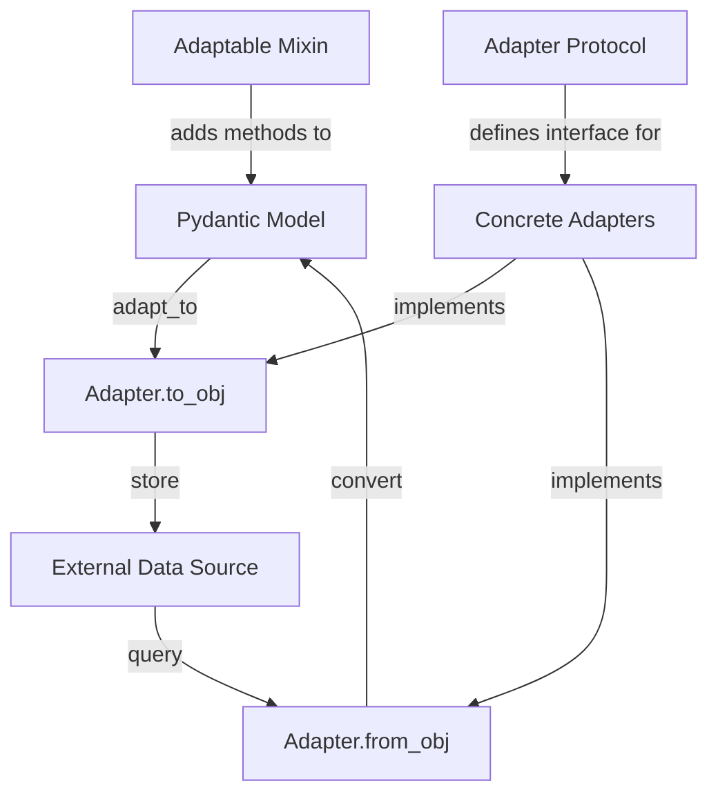

# Research Report: Adapter Integration Patterns

## Executive Summary

This report analyzes the implementation patterns in existing Pydapter adapters to establish consistent integration standards for new adapters being developed. By examining both synchronous and asynchronous adapters, we've identified core patterns and inconsistencies that need to be addressed for the Neo4j, Weaviate, and AsyncWeaviate adapters in development.

Key findings indicate that successful adapters follow a structured error handling approach, maintain compatibility with the core interfaces, and include comprehensive testing. The current dev implementations are functional but incomplete, requiring additional error handling, validation, and testing to meet the project's standards. We recommend a phased integration approach that prioritizes error handling and protocol compliance before optimization.

## 1. Introduction

### 1.1 Research Objective

This research aims to establish clear integration standards for new database adapters being developed for the Pydapter framework. Specifically, we need to ensure consistent implementation patterns for three adapters from the dev directory:

1. AsyncNeo4jAdapter (Issue #67)
2. WeaviateAdapter (Issue #68)
3. AsyncWeaviateAdapter (Issue #68)

### 1.2 Methodology

Our approach involved:
1. Analyzing existing adapter code (Neo4j, AsyncPostgres)
2. Comparing with new adapter implementations in the dev directory
3. Reviewing testing patterns and error handling approaches
4. Identifying common interface patterns and deviations

Sources examined include core adapter interfaces, exception handling, existing adapters' implementation, and test suites.

### 1.3 Context

Pydapter provides a consistent interface for converting between Pydantic models and various data formats or storage systems. The adapter layer is a critical component of this architecture, enabling seamless two-way conversion while abstracting away the complexities of specific backends. Adding new adapters extends the framework's capabilities but requires careful adherence to established patterns.

## 2. Technical Analysis

### 2.1 Technology Landscape

Pydapter's adapter ecosystem consists of:

1. **Core Adapters**: Simple format converters (JSON, CSV, TOML)
2. **Data Analysis Adapters**: Pandas DataFrame, Excel
3. **Database Adapters**: PostgreSQL, MongoDB, Neo4j, Qdrant, SQL
4. **Async Counterparts**: Async versions of database adapters

The adapters being integrated fall into the database category, with both synchronous and asynchronous implementations.

### 2.2 Comparative Analysis

| Factor               | Neo4j Adapter | AsyncNeo4j (dev) | Weaviate (dev) | AsyncWeaviate (dev) |
|----------------------|---------------|------------------|----------------|---------------------|
| Error Handling       | ⭐⭐⭐⭐⭐     | ⭐              | ⭐⭐           | ⭐⭐                |
| Protocol Compliance  | ⭐⭐⭐⭐⭐     | ⭐⭐⭐⭐         | ⭐⭐⭐⭐       | ⭐⭐⭐⭐             |
| Documentation        | ⭐⭐⭐⭐       | ⭐              | ⭐⭐           | ⭐⭐                |
| Input Validation     | ⭐⭐⭐⭐⭐     | ⭐              | ⭐⭐           | ⭐⭐                |
| Resource Management  | ⭐⭐⭐⭐       | ⭐⭐⭐           | ⭐⭐⭐         | ⭐⭐⭐               |
| API Consistency      | ⭐⭐⭐⭐⭐     | ⭐⭐⭐           | ⭐⭐⭐⭐       | ⭐⭐⭐               |

#### Neo4j vs AsyncNeo4j

The existing Neo4j adapter provides comprehensive error handling with specific exception types, parameter validation, connection management, and Cypher query validation. In contrast, the dev AsyncNeo4j adapter offers minimal error handling, no input validation, and simplified API interactions. However, it properly implements async patterns with appropriate syntax.

#### Weaviate adapters

The Weaviate adapters follow correct interface patterns but lack comprehensive error handling. The synchronous adapter uses the official client library, while the async implementation uses direct REST API calls via aiohttp. Both implementations handle basic operations but don't validate inputs or provide detailed error context.

### 2.3 Performance Considerations

For database adapters, the primary performance considerations involve:

1. **Connection pooling**: The sync Neo4j adapter creates and closes connections for each operation, whereas proper pooling could improve performance.
2. **Batching operations**: All adapters handle multiple items, but batch processing efficiency varies.
3. **Async performance**: The async adapters potentially offer better scalability under high concurrency but must properly release resources.

### 2.4 Security Implications

Two key security considerations in adapter implementations:

1. **Query injection protection**: The Neo4j adapter includes validation for Cypher queries to prevent injection attacks, but the dev implementations lack this protection.
2. **Error message leakage**: Detailed error messages could expose internal implementation details if not properly sanitized before reaching clients.

### 2.5 Scalability Assessment

Async adapters offer better scalability in high-concurrency scenarios by not blocking the main thread. However, the current dev implementations need improvements in resource management to fully realize this benefit. All database adapters should eventually implement connection pooling for proper scaling.

## 3. Implementation Patterns

### 3.1 Architecture Patterns



The primary patterns identified:

1. **Protocol Definition**: Both `Adapter` and `AsyncAdapter` protocols define the interface all adapters must implement.
2. **Adaptable Mixin**: Provides convenience methods for models to use adapters.
3. **Registry Mechanism**: Manages adapter registration and lookup.
4. **Error Handling**: Standardized exception hierarchy for adapter-specific errors.

### 3.2 Code Examples

#### Standard Adapter Pattern (Sync)

```python
class ExampleAdapter(Adapter[T]):
    obj_key = "example"
    
    @classmethod
    def from_obj(cls, subj_cls: type[T], obj: dict, /, *, many=False, **kw):
        try:
            # Validate required parameters
            if "required_param" not in obj:
                raise AdapterValidationError("Missing required parameter")
                
            # Connect to data source
            connection = cls._create_connection(obj["connection_info"])
            
            # Query data
            try:
                result = connection.query(obj["query_params"])
            except ExternalLibraryError as e:
                raise QueryError(f"Query failed: {e}", query=obj["query_params"])
            finally:
                connection.close()
            
            # Convert to models
            try:
                if many:
                    return [subj_cls.model_validate(r) for r in result]
                return subj_cls.model_validate(result[0])
            except ValidationError as e:
                raise AdapterValidationError(f"Validation error: {e}", errors=e.errors())
                
        except (ConnectionError, QueryError, AdapterValidationError):
            # Re-raise our custom exceptions
            raise
        except Exception as e:
            # Wrap unexpected errors
            raise QueryError(f"Unexpected error: {e}")
```

#### Standard Async Adapter Pattern

```python
class ExampleAsyncAdapter(AsyncAdapter[T]):
    obj_key = "async_example"
    
    @classmethod
    async def from_obj(cls, subj_cls: type[T], obj: dict, /, *, many=False, **kw):
        try:
            # Validate required parameters
            if "required_param" not in obj:
                raise AdapterValidationError("Missing required parameter")
                
            # Connect to data source
            connection = await cls._create_connection(obj["connection_info"])
            
            # Query data
            try:
                result = await connection.query(obj["query_params"])
            except ExternalLibraryError as e:
                raise QueryError(f"Query failed: {e}", query=obj["query_params"])
            finally:
                await connection.close()
            
            # Convert to models
            try:
                if many:
                    return [subj_cls.model_validate(r) for r in result]
                return subj_cls.model_validate(result[0])
            except ValidationError as e:
                raise AdapterValidationError(f"Validation error: {e}", errors=e.errors())
                
        except (ConnectionError, QueryError, AdapterValidationError):
            # Re-raise our custom exceptions
            raise
        except Exception as e:
            # Wrap unexpected errors
            raise QueryError(f"Unexpected error: {e}")
```

### 3.3 Error Handling Strategy

The Pydapter framework defines a rich exception hierarchy for adapters:

1. **Base `AdapterError`**: Parent for all adapter exceptions
2. **`ValidationError`**: Data validation issues
3. **`ConnectionError`**: Database connection failures
4. **`QueryError`**: Database query execution failures
5. **`ResourceError`**: When a resource cannot be accessed
6. **`ConfigurationError`**: Adapter configuration problems
7. **`AdapterNotFoundError`**: When an adapter isn't registered

Adapters should:
1. Catch external library exceptions and re-raise as appropriate adapter exceptions
2. Use specific exception types based on the error context
3. Include relevant context data (query, connection info, etc.) in exceptions
4. Wrap unexpected errors in generic adapter exceptions

### 3.4 Testing Approach

Analysis of existing test patterns reveals:

1. **Protocol Compliance Tests**: Verify adapter implements required methods and attributes
2. **Mocked Database Connections**: Use unittest.mock to simulate database operations
3. **Roundtrip Testing**: Verify data integrity through to_obj and from_obj operations
4. **Error Handling Tests**: Confirm appropriate exceptions are raised for various error conditions
5. **Parameter Validation**: Test with various input combinations to ensure validation works

## 4. Integration Considerations

### 4.1 Dependencies

Each adapter has specific dependencies:

1. **AsyncNeo4jAdapter**: Requires Neo4j's AsyncGraphDatabase
2. **WeaviateAdapter**: Requires weaviate-client
3. **AsyncWeaviateAdapter**: Requires aiohttp for async HTTP communication

All adapters require Pydantic v2 for model validation and type handling.

### 4.2 Configuration Requirements

For proper integration, adapters need configurations for:

1. **Connection details**: URLs, authentication, etc.
2. **Query parameters**: Labels, collections, etc.
3. **Performance settings**: Batch sizes, timeouts, etc.

Configuration should be handled through:
- Required parameters in method signatures
- Optional parameters with sensible defaults
- Validation early in the method flow

### 4.3 Interface Design

All adapters should provide a consistent interface aligned with the core protocols:

```python
# Sync Adapter
@classmethod
def from_obj(cls, subj_cls: type[T], obj: Any, /, *, many: bool = False, **kw): ...

@classmethod
def to_obj(cls, subj: T | list[T], /, *, many: bool = False, **kw): ...

# Async Adapter
@classmethod
async def from_obj(cls, subj_cls: type[T], obj: Any, /, *, many: bool = False, **kw) -> T | list[T]: ...

@classmethod
async def to_obj(cls, subj: T | list[T], /, *, many: bool = False, **kw) -> Any: ...
```

## 5. Recommendations

### 5.1 Recommended Approach

Based on our analysis, we recommend:

1. **Enhance Error Handling**: Add comprehensive error handling to all dev adapters, following the pattern in the existing Neo4j adapter (pplx:ef2cf27a-6688-4667-804a-d5d31f3f79a5).
2. **Add Parameter Validation**: Validate all required parameters early in the method flow.
3. **Improve Resource Management**: Ensure connections are properly closed, especially in async contexts.
4. **Standardize Method Signatures**: Ensure all adapters follow the same parameter patterns for consistency.
5. **Add Security Validations**: Implement query validation similar to Neo4j's `_validate_cypher` method.
6. **Define Clear Interfaces**: Ensure adapter interfaces are well-defined and consistent with the core protocol (pplx:ef2cf27a-6688-4667-804a-d5d31f3f79a5).

### 5.2 Implementation Roadmap

**Phase 1: Compliance and Error Handling**
- Add error handling to AsyncNeo4jAdapter
- Implement parameter validation in all dev adapters
- Update method signatures for consistency
- Add proper monitoring and logging (pplx:ef2cf27a-6688-4667-804a-d5d31f3f79a5)

**Phase 2: Testing and Documentation**
- Create comprehensive test suites for each adapter
- Add protocol compliance tests
- Document adapter usage patterns
- Implement thorough unit and integration tests (pplx:ef2cf27a-6688-4667-804a-d5d31f3f79a5)

**Phase 3: Performance Optimization**
- Implement connection pooling
- Add batch processing optimizations
- Performance benchmarking
- Improve concurrency control for async adapters (pplx:ef2cf27a-6688-4667-804a-d5d31f3f79a5)

### 5.3 Risk Assessment

Potential integration risks include:

1. **Async Resource Leaks**: Improper async resource management can lead to connection leaks
2. **Inconsistent Error Handling**: Inconsistent error reporting can confuse users
3. **Breaking API Changes**: Changes to established patterns may break existing code
4. **Dependency Conflicts**: Newer versions of Neo4j or Weaviate clients may have breaking changes

Mitigation strategies:
- Comprehensive testing, especially for async adapters
- Backward compatibility checks
- Dependency version pinning in requirements.txt

### 5.4 Alternative Approaches

If the recommended approach proves challenging:

1. **Simplified Error Handling**: Focus on basic error categories if the full hierarchy is too complex
2. **Wrapper Classes**: Create wrapper classes around client libraries to standardize APIs
3. **Connection Factories**: Implement connection factory patterns to manage resources centrally

## 6. References

1. [Pydantic Documentation](https://docs.pydantic.dev/) - Model validation
2. [Neo4j Python Driver](https://neo4j.com/docs/api/python-driver/current/) - Neo4j driver API
3. [Weaviate Python Client](https://weaviate.io/developers/weaviate/client-libraries/python) - Weaviate client
4. [Adapter Design Pattern in Python](https://dev.to/bshadmehr/bridging-the-gap-with-the-adapter-design-pattern-in-python-k31) - Implementation patterns
5. [Synchronous vs. Asynchronous Integration](https://www.elastic.io/integration-best-practices/synchronous-vs-asynchronous-integration/) - Integration approaches

## Appendices

### Appendix A: Adapter Protocol Comparison

#### Sync Adapter (core.py)
```python
@runtime_checkable
class Adapter(Protocol[T]):
    """Stateless conversion helper."""

    obj_key: ClassVar[str]

    @classmethod
    def from_obj(cls, subj_cls: type[T], obj: Any, /, *, many: bool = False, **kw): ...

    @classmethod
    def to_obj(cls, subj: T | list[T], /, *, many: bool = False, **kw): ...
```

#### Async Adapter (async_core.py)
```python
@runtime_checkable
class AsyncAdapter(Protocol[T]):
    """Stateless, **async** conversion helper."""

    obj_key: ClassVar[str]

    @classmethod
    async def from_obj(
        cls, subj_cls: type[T], obj: Any, /, *, many: bool = False, **kw
    ) -> T | list[T]: ...

    @classmethod
    async def to_obj(cls, subj: T | list[T], /, *, many: bool = False, **kw) -> Any: ...
```

### Appendix B: Raw JSON Search Evidence

```json
{
  "id": "ef2cf27a-6688-4667-804a-d5d31f3f79a5",
  "model": "sonar",
  "created": 1747262389,
  "usage": {"prompt_tokens": 20, "completion_tokens": 662, "total_tokens": 682, "search_context_size": "low"},
  "citations": [
    "https://dev.to/bshadmehr/bridging-the-gap-with-the-adapter-design-pattern-in-python-k31",
    "https://codesarray.com/view/Adapter-Pattern-in-Python",
    "https://refactoring.guru/design-patterns/adapter",
    "https://www.elastic.io/integration-best-practices/synchronous-vs-asynchronous-integration/",
    "https://docs.oracle.com/en/cloud/paas/application-integration/integrations-user/add-actions-app-driven-orchestration-integration.html"
  ],
  "object": "chat.completion",
  "choices": [
    {
      "index": 0,
      "finish_reason": "stop",
      "message": {
        "role": "assistant",
        "content": "Implementing the Adapter Pattern in Python for database integrations is crucial for ensuring compatibility between different systems, especially when dealing with synchronous and asynchronous approaches. Here are some best practices to consider:\n\n## Best Practices for Implementing Adapter Patterns\n\n### **1. Define Clear Interfaces**\n- **Adaptee Interface**: This is the existing interface of the database system you are integrating with. Define its methods clearly.\n- **Target Interface**: This is the interface expected by your application. Ensure it aligns with your application's requirements.\n- Example:\n  ```python\n  class DatabaseInterface:\n      def connect(self):\n          pass\n\n      def query(self, query_string):\n          pass\n\n      def close(self):\n          pass\n  ```\n\n### **2. Implement the Adapter Class**\n- The adapter class should implement the target interface and encapsulate the adaptee.\n- It should translate calls to the target interface into calls to the adaptee's interface.\n- Example:\n  ```python\n  class DatabaseAdapter(DatabaseInterface):\n      def __init__(self, database_system):\n          self.database_system = database_system\n\n      def connect(self):\n          # Connect using the database system's method\n          self.database_system.connect()\n\n      def query(self, query_string):\n          # Translate query and execute it using the database system's method\n          result = self.database_system.execute_query(query_string)\n          return result\n\n      def close(self):\n          # Close using the database system's method\n          self.database_system.close_connection()\n  ```\n\n### **3. Handle Synchronous Integration**\n- **Require Immediate Response**: Use synchronous integration for operations requiring immediate responses, such as real-time data display.\n- **Timeouts and Failovers**: Implement timeouts and failover mechanisms to handle potential issues like connection timeouts or service unavailability.\n- Example:\n  ```python\n  def query_synchronously(self, query_string):\n      try:\n          result = self.query(query_string)\n          return result\n      except Exception as e:\n          # Handle exception or retry connection\n          print(f\"Error: {e}\")\n  ```\n\n### **4. Handle Asynchronous Integration**\n- **Non-Blocking Operations**: Use asynchronous integration for operations that don't require immediate responses, such as background data processing.\n- **Callbacks or Futures**: Use callbacks or futures to handle results of asynchronous operations.\n- **Concurrency Control**: Manage concurrency to avoid overloading resources.\n- Example (using asyncio):\n  ```python\n  import asyncio\n\n  async def query_asynchronously(self, query_string):\n      loop = asyncio.get_running_loop()\n      result = await loop.run_in_executor(None, self.query, query_string)\n      return result\n  ```\n\n### **5. Monitor and Log Operations**\n- **Logging Mechanisms**: Implement logging to track integration operations, especially for debugging and monitoring purposes.\n- **Error Handling**: Develop robust error handling to manage unexpected errors during integration.\n\n### **6. Test Thoroughly**\n- **Unit Tests**: Write unit tests to ensure each method of the adapter works as expected.\n- **Integration Tests**: Perform integration tests to verify that the adapter integrates correctly with both the application and the database.\n\nBy following these best practices, you can effectively integrate different database systems using the Adapter Pattern in Python, supporting both synchronous and asynchronous approaches."
      },
      "delta": {"role": "assistant", "content": ""}
    }
  ]
}