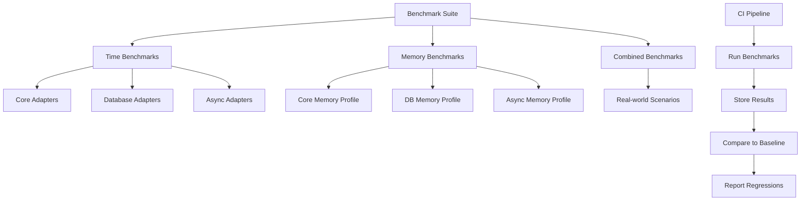
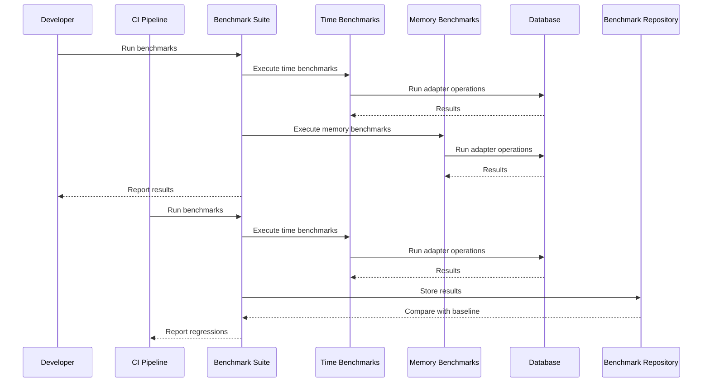
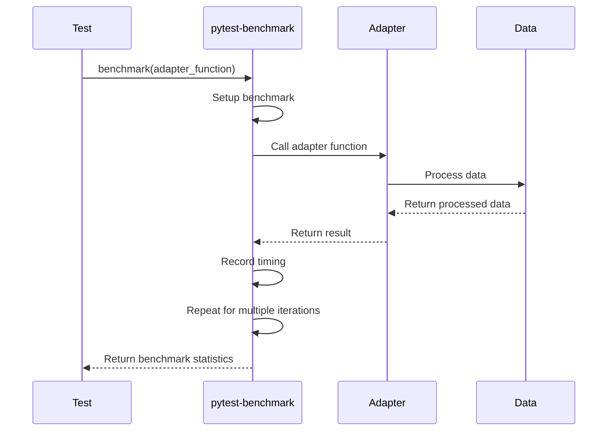
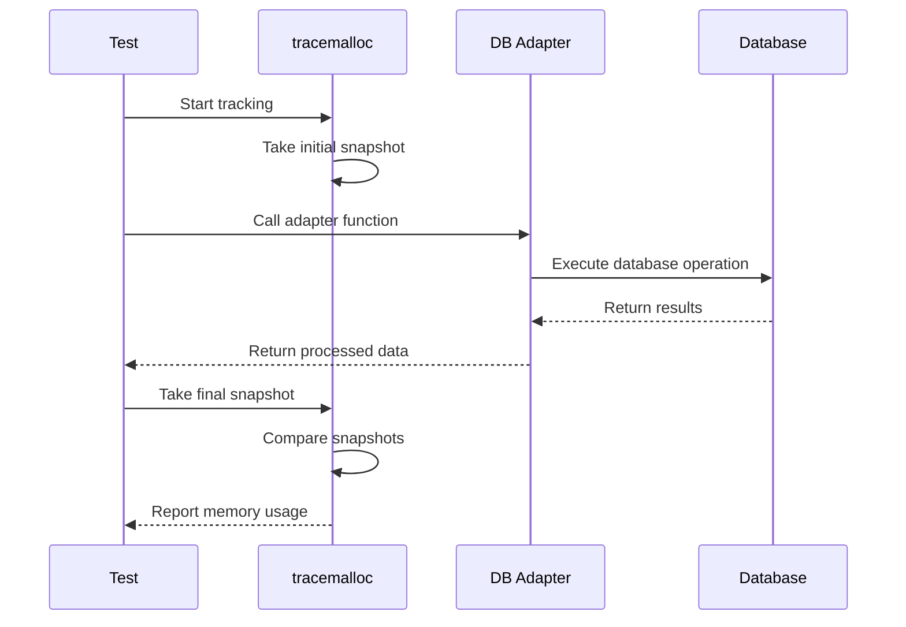

# Technical Design Specification: Performance Benchmarking

## 1. Overview

### 1.1 Purpose

This specification details the technical design for implementing a comprehensive
performance benchmarking system for pydapter adapter operations, enabling
consistent measurement of execution time and memory usage across all adapter
types.

### 1.2 Scope

The performance benchmarking system will cover:

- Time benchmarking for all adapter types (core, database, async)
- Memory usage profiling, with special focus on database operations
- Comparative benchmarks across adapter implementations
- Integration with CI/CD pipeline for performance regression detection
- Reporting and visualization of benchmark results

Out of scope:

- Full-scale production performance analysis
- Auto-optimization based on benchmark results
- External benchmark comparisons with other libraries

### 1.3 Background

As identified in Issue #21 and detailed in the research report (RR-21.md),
pydapter needs a standardized approach to performance benchmarking. Currently,
the project has some benchmark testing in `tests/test_benchmarks.py` and
`tests/test_bench_json.py`, but requires a more systematic approach.

The research identified `pytest-benchmark` as the optimal tool for execution
time measurement and `tracemalloc` for memory usage tracking, with special
considerations for async adapter benchmarking.

### 1.4 Design Goals

- **Accuracy**: Provide precise measurements of execution time and memory usage
- **Consistency**: Ensure benchmark results are comparable across runs and
  environments
- **Comprehensiveness**: Cover all adapter types and operations
- **Integration**: Seamlessly fit into existing testing frameworks and CI/CD
  pipelines
- **Usability**: Make it easy for developers to run benchmarks and interpret
  results
- **Extensibility**: Allow for easy addition of new benchmarks as the library
  evolves

### 1.5 Key Constraints

- Benchmarks must run efficiently in CI environments without excessive resource
  consumption
- Database benchmarks must use isolated test databases to prevent production
  data exposure
- Async benchmarks must account for event loop specifics and concurrency
  patterns
- Statistical validity requires multiple runs while keeping overall execution
  time reasonable

## 2. Architecture

### 2.1 Component Diagram



### 2.2 Dependencies

- **pytest-benchmark**: Primary tool for execution time measurement
- **tracemalloc**: Standard library module for memory allocation tracking
- **pytest-asyncio**: For testing async adapters
- **testcontainers** (optional): For isolated database testing
- **matplotlib** (optional): For visualization of benchmark results

### 2.3 Data Flow



## 3. Interface Definitions

### 3.1 API Endpoints

#### Benchmark Runner Interface

```python
def run_benchmarks(benchmark_type: str = "all", 
                   adapter_type: str = "all",
                   extended: bool = False,
                   output_format: str = "console") -> Dict:
    """
    Run specified benchmarks and return results.
    
    Args:
        benchmark_type: Type of benchmark to run ("time", "memory", "combined", "all")
        adapter_type: Type of adapter to benchmark ("core", "db", "async", "all")
        extended: Whether to run extended benchmarks (more iterations, larger datasets)
        output_format: Output format ("console", "json", "csv")
        
    Returns:
        Dictionary containing benchmark results
    """
```

#### Memory Profiling Interface

```python
def profile_memory(func: Callable, 
                   *args, 
                   snapshot_at: List[str] = None,
                   **kwargs) -> Dict:
    """
    Profile memory usage of a function with tracemalloc.
    
    Args:
        func: Function to profile
        *args: Arguments to pass to function
        snapshot_at: Points at which to take memory snapshots ("start", "end", "step")
        **kwargs: Keyword arguments to pass to function
        
    Returns:
        Dictionary containing memory profiling results
    """
```

### 3.2 Internal Interfaces

#### Benchmark Fixture Interface

```python
@pytest.fixture
def memory_benchmark():
    """
    Pytest fixture for benchmarking memory usage.
    
    Usage:
        def test_function(memory_benchmark):
            memory_benchmark(my_function, arg1, arg2)
    """
    tracemalloc.start()
    snapshot_start = tracemalloc.take_snapshot()
    
    def _benchmark(func, *args, **kwargs):
        result = func(*args, **kwargs)
        snapshot_end = tracemalloc.take_snapshot()
        stats = snapshot_end.compare_to(snapshot_start, 'lineno')
        
        # Return result along with memory stats
        return result, stats
    
    yield _benchmark
    tracemalloc.stop()
```

## 4. Data Models

### 4.1 API Models

```python
class BenchmarkResult(BaseModel):
    """Model for benchmark results."""
    name: str
    min_time: float  # seconds
    max_time: float  # seconds
    mean_time: float  # seconds
    median_time: float  # seconds
    stddev_time: float  # seconds
    iterations: int
    timestamp: datetime = Field(default_factory=datetime.now)
    commit_hash: Optional[str] = None
    environment: Dict[str, str] = Field(default_factory=dict)
```

```python
class MemoryProfileResult(BaseModel):
    """Model for memory profiling results."""
    name: str
    peak_memory: int  # bytes
    allocated_memory: int  # bytes
    deallocated_memory: int  # bytes
    net_memory: int  # bytes
    top_allocations: List[Dict[str, Any]]
    timestamp: datetime = Field(default_factory=datetime.now)
    commit_hash: Optional[str] = None
    environment: Dict[str, str] = Field(default_factory=dict)
```

### 4.2 Domain Models

```python
class BenchmarkConfig:
    """Configuration for benchmark runs."""
    def __init__(self,
                 iterations: int = 100,
                 warmup_iterations: int = 5,
                 min_time: float = 0.1,  # seconds
                 max_time: float = 60.0,  # seconds
                 disable_gc: bool = True,
                 timer: str = "perf_counter"):
        self.iterations = iterations
        self.warmup_iterations = warmup_iterations
        self.min_time = min_time
        self.max_time = max_time
        self.disable_gc = disable_gc
        self.timer = timer
```

```python
class AdapterBenchmark:
    """Base class for adapter benchmarks."""
    def __init__(self, adapter_class, config: BenchmarkConfig = None):
        self.adapter_class = adapter_class
        self.config = config or BenchmarkConfig()
        
    def setup(self):
        """Setup benchmark environment."""
        pass
        
    def teardown(self):
        """Teardown benchmark environment."""
        pass
        
    def run(self, benchmark):
        """Run the benchmark."""
        raise NotImplementedError
```

### 4.3 Database Schema

For storing benchmark results over time (optional, could be implemented in later
phases):

```sql
CREATE TABLE benchmark_results (
    id SERIAL PRIMARY KEY,
    name VARCHAR(255) NOT NULL,
    min_time DOUBLE PRECISION NOT NULL,
    max_time DOUBLE PRECISION NOT NULL,
    mean_time DOUBLE PRECISION NOT NULL,
    median_time DOUBLE PRECISION NOT NULL,
    stddev_time DOUBLE PRECISION NOT NULL,
    iterations INTEGER NOT NULL,
    timestamp TIMESTAMP NOT NULL DEFAULT NOW(),
    commit_hash VARCHAR(40),
    environment JSONB
);

CREATE TABLE memory_profile_results (
    id SERIAL PRIMARY KEY,
    name VARCHAR(255) NOT NULL,
    peak_memory BIGINT NOT NULL,
    allocated_memory BIGINT NOT NULL,
    deallocated_memory BIGINT NOT NULL,
    net_memory BIGINT NOT NULL,
    top_allocations JSONB NOT NULL,
    timestamp TIMESTAMP NOT NULL DEFAULT NOW(),
    commit_hash VARCHAR(40),
    environment JSONB
);
```

## 5. Behavior

### 5.1 Core Workflows

#### Core Adapter Time Benchmarking



#### Database Adapter Memory Profiling



### 5.2 Error Handling

- **Benchmark failures**: Each benchmark should be isolated, with failures in
  one benchmark not affecting others.
- **Environment issues**: If benchmark environment cannot be properly set up
  (e.g., database connection failure), the benchmark should be skipped rather
  than failed.
- **Performance thresholds**: When performance degrades beyond acceptable
  thresholds, benchmarks should fail with clear messages about the regression.
- **Statistical anomalies**: Extremely variable results should be flagged for
  review rather than immediately failing the benchmark.

Code example:

```python
def test_adapter_performance(benchmark):
    """Test adapter performance with thresholds."""
    result = benchmark(adapter_function, test_data)
    
    # Check if performance is within acceptable range
    assert result.median < 0.01, f"Performance regression detected: median time {result.median}s exceeds threshold of 0.01s"
    assert result.stddev < result.median * 0.1, f"Performance is too variable: stddev {result.stddev}s exceeds 10% of median {result.median}s"
```

### 5.3 Security Considerations

- **Test data**: All benchmarks should use synthetic test data rather than real
  user data.
- **Database credentials**: Benchmark code should not hardcode or expose
  database credentials.
- **Resource consumption**: Benchmarks should include limits on resource
  consumption to prevent potential DoS situations.
- **Isolation**: Database benchmarks should run in isolated environments to
  prevent accidental data modification.

## 6. External Interactions

### 6.1 Dependencies on Other Services

Database benchmarks will depend on database services:

- **PostgreSQL**: For testing `PostgresAdapter` and `AsyncPostgresAdapter`
- **MongoDB**: For testing `MongoAdapter` and `AsyncMongoAdapter`
- **Neo4j**: For testing `Neo4jAdapter`
- **Qdrant**: For testing `QdrantAdapter` and `AsyncQdrantAdapter`

These dependencies should be managed through fixtures that:

1. Use testcontainers to create isolated database instances
2. Set up necessary schema and test data
3. Tear down cleanly after tests

Example:

```python
@pytest.fixture(scope="module")
def postgres_container():
    """Fixture for isolated PostgreSQL container."""
    container = PostgresContainer("postgres:14")
    container.start()
    yield container
    container.stop()

@pytest.fixture
def postgres_connection(postgres_container):
    """Fixture for PostgreSQL connection."""
    conn = psycopg2.connect(
        host=postgres_container.get_container_host_ip(),
        port=postgres_container.get_exposed_port(5432),
        user=postgres_container.POSTGRES_USER,
        password=postgres_container.POSTGRES_PASSWORD,
        database=postgres_container.POSTGRES_DB
    )
    yield conn
    conn.close()
```

### 6.2 External API Integrations

No direct external API integrations are required for the benchmarking system.
All interactions will be with the pydapter adapters and their target databases
or file formats.

## 7. Performance Considerations

### 7.1 Expected Load

- **CI Pipeline**: Benchmarks should complete within 5-10 minutes in CI
  environments.
- **Local Development**: Quick benchmarks should complete within 1-2 minutes
  locally.
- **Extended Benchmarks**: Extended benchmarks may run longer (10-30 minutes)
  but should be opt-in.

### 7.2 Scalability Approach

- **Selective Benchmarking**: Allow running benchmarks for specific adapters
  only.
- **Sampling**: For large datasets, use statistical sampling to reduce runtime.
- **Parallelization**: Run independent benchmarks in parallel where possible.
- **CI Matrix**: Split benchmarks across multiple CI jobs for faster completion.

### 7.3 Optimizations

- **Warm-up Runs**: Include warm-up runs to eliminate JIT compilation effects.
- **Garbage Collection Control**: Disable GC during time-sensitive benchmark
  runs.
- **Resource Limiting**: Limit memory and CPU usage for consistent results.
- **Database Preparation**: Pre-populate databases to eliminate setup overhead.

### 7.4 Caching Strategy

- **Test Data**: Cache generated test data between benchmark runs.
- **Database State**: Create database snapshots for quick restoration between
  tests.
- **Benchmark Results**: Cache results for comparison across runs.

## 8. Observability

### 8.1 Logging

- **Benchmark Progress**: Log progress during extended benchmark runs.
- **Environment Details**: Log details about the environment (Python version,
  OS, etc.).
- **Statistical Outliers**: Log warnings for statistically significant outliers.

Example:

```python
import logging

logger = logging.getLogger("pydapter.benchmarks")

def run_benchmark_suite():
    """Run the full benchmark suite with logging."""
    logger.info("Starting benchmark suite")
    logger.info(f"Environment: Python {sys.version}, OS: {platform.platform()}")
    
    # Run benchmarks
    
    logger.info("Benchmark suite completed")
```

### 8.2 Metrics

Key metrics to track:

- **Execution Time**: min, max, mean, median, stddev
- **Memory Usage**: peak, allocated, deallocated, net
- **Operation Throughput**: operations per second
- **Scalability**: performance change with data size increase

### 8.3 Tracing

For async adapters, track:

- **Event Loop Iteration Time**: time spent in each event loop iteration
- **Task Wait Time**: time tasks spend waiting vs. executing
- **Concurrent Task Count**: number of tasks running concurrently

## 9. Testing Strategy

### 9.1 Unit Testing

- **Benchmark Utilities**: Test benchmark utility functions for correctness.
- **Result Validation**: Test result validation logic.
- **Configuration Parsing**: Test benchmark configuration parsing.

### 9.2 Integration Testing

- **Adapter Coverage**: Ensure all adapters have corresponding benchmarks.
- **Database Connectivity**: Test database fixture setup.
- **CI Integration**: Test benchmark execution in CI-like environment.

### 9.3 Performance Testing

Meta-benchmarks to validate the benchmarking system itself:

- **Stability**: Run same benchmark multiple times to check consistency.
- **Overhead**: Measure overhead added by benchmarking instrumentation.
- **Isolation**: Verify benchmarks don't interfere with each other.

## 10. Deployment and Configuration

### 10.1 Deployment Requirements

- **pytest plugins**: Ensure pytest-benchmark and pytest-asyncio are installed.
- **Database dependencies**: Include necessary database drivers for adapter
  tests.
- **CI configuration**: Set up GitHub Actions workflow for running benchmarks.

### 10.2 Configuration Parameters

```toml
# pyproject.toml

[tool.pytest.ini_options]
# Benchmark storage location
benchmark_storage = ".benchmarks"

# Auto-save benchmark results
benchmark_autosave = true

# Minimum time for benchmark runs
benchmark_min_time = "0.1"

# Generate histograms for benchmark results
benchmark_histogram = ".benchmarks/histograms"

# Report the 5 slowest tests
benchmark_slowest = 5

[tool.pydapter.benchmarks]
# Default number of iterations
iterations = 100

# Default warmup iterations
warmup_iterations = 5

# Whether to disable garbage collection during benchmarks
disable_gc = true

# Default dataset sizes
small_dataset_size = 100
medium_dataset_size = 1000
large_dataset_size = 10000

# Memory thresholds (bytes)
max_memory_core = 10_000_000  # 10 MB
max_memory_db = 50_000_000    # 50 MB
max_memory_async = 20_000_000 # 20 MB
```

## 11. Open Questions

- Should benchmark results be stored long-term for historical comparisons?
- What is the appropriate balance between benchmark coverage and execution time
  in CI?
- Should benchmarks automatically create visualizations for result analysis?
- How should we handle environment-specific variability in benchmark results?
- What is the maximum acceptable performance regression before failing CI?

## 12. Appendices

### Appendix A: Alternative Designs

#### Option 1: Custom Benchmarking Framework

Instead of using pytest-benchmark, a custom benchmarking framework could be
developed. This would offer more flexibility but require significantly more
development effort.

#### Option 2: External Benchmarking Service

Benchmarks could be run on an external service for consistent hardware
environment. This would provide more reliable results but add complexity to the
CI pipeline.

#### Option 3: Continuous Profiling

Instead of point-in-time benchmarks, continuous profiling during regular tests
could be implemented. This would provide more data but be harder to analyze for
specific performance changes.

### Appendix B: Research References

This design is based on the research report RR-21.md, which conducted detailed
analysis of benchmarking tools and practices for Python libraries. Key findings
included:

1. pytest-benchmark provides the most comprehensive execution time benchmarking
   with statistical analysis (reference: RR-21.md, section 2.2)
2. tracemalloc is recommended for memory profiling, especially for database
   operations (reference: RR-21.md, section 2.2)
3. Special considerations are needed for async adapter benchmarking (reference:
   RR-21.md, section 3.3)
4. Integration with CI/CD pipelines is essential for tracking performance across
   versions (reference: RR-21.md, section 4.2)

### Appendix C: Example Benchmark Implementations

#### Example 1: Core Adapter Time Benchmark

```python
import pytest
from pydantic import BaseModel
from pydapter.adapters import JsonAdapter
from pydapter.core import Adaptable

class SampleModel(Adaptable, BaseModel):
    id: int
    name: str
    value: float

    class Config:
        arbitrary_types_allowed = True

@pytest.fixture
def sample_model():
    model = SampleModel(id=1, name="test", value=42.5)
    model.register_adapter(JsonAdapter)
    return model

def test_json_serialization(benchmark, sample_model):
    """Benchmark JsonAdapter serialization."""
    benchmark(sample_model.adapt_to, obj_key="json")

def test_json_deserialization(benchmark, sample_model):
    """Benchmark JsonAdapter deserialization."""
    json_data = sample_model.adapt_to(obj_key="json")
    benchmark(SampleModel.adapt_from, json_data, obj_key="json")
```

#### Example 2: Database Adapter Memory Profile

```python
import pytest
import tracemalloc
from pydapter.extras.postgres_ import PostgresAdapter

def test_postgres_insert_memory_profile(db_connection, sample_models):
    """Profile memory usage of PostgresAdapter insert operations."""
    # Setup
    PostgresAdapter.configure(connection=db_connection)
    models = [sample_models() for _ in range(100)]
    
    # Start memory tracking
    tracemalloc.start()
    snapshot1 = tracemalloc.take_snapshot()
    
    # Perform operation
    PostgresAdapter.to_obj(models, many=True)
    
    # Capture and analyze memory usage
    snapshot2 = tracemalloc.take_snapshot()
    top_stats = snapshot2.compare_to(snapshot1, 'lineno')
    
    # Print top 10 memory allocations
    for stat in top_stats[:10]:
        print(stat)
    
    # Memory should not exceed reasonable threshold
    memory_increase = sum(stat.size_diff for stat in top_stats)
    assert memory_increase < 10 * 1024 * 1024  # 10MB limit
    
    # Stop tracemalloc
    tracemalloc.stop()
```

#### Example 3: Async Adapter Benchmark

```python
import asyncio
import pytest
import time
from statistics import mean, stdev

from pydapter.extras.async_postgres_ import AsyncPostgresAdapter

@pytest.mark.asyncio
async def test_async_postgres_query_performance(benchmark, async_pg_connection):
    """Benchmark async postgres query performance."""
    # Setup
    AsyncPostgresAdapter.configure(connection=async_pg_connection)
    query = "SELECT * FROM test_table LIMIT 100"
    
    # Define async function to benchmark
    async def run_query():
        return await async_pg_connection.fetch(query)
    
    # Use pytest-benchmark to handle the async function
    result = benchmark(run_query)
    
    # Assert performance is within expected range
    assert benchmark.stats.median < 0.01  # Example threshold: 10ms
```
