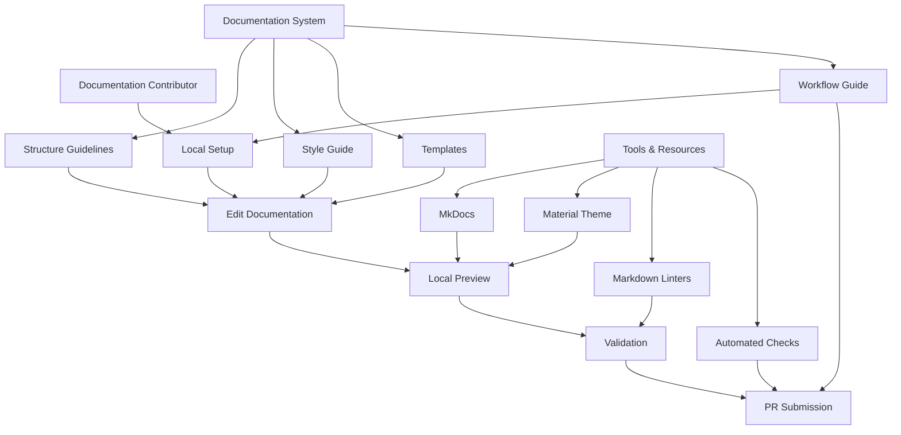
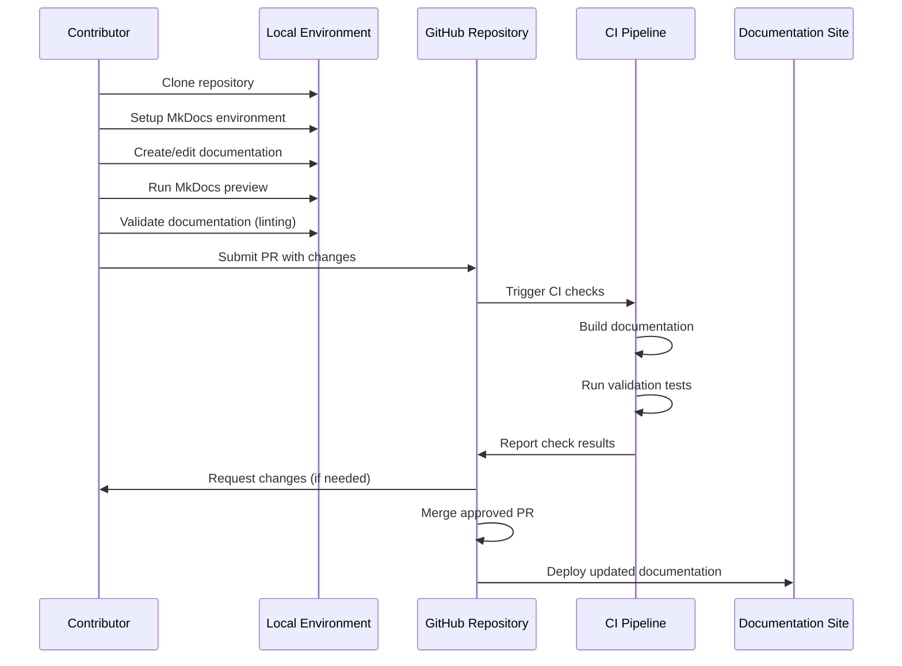
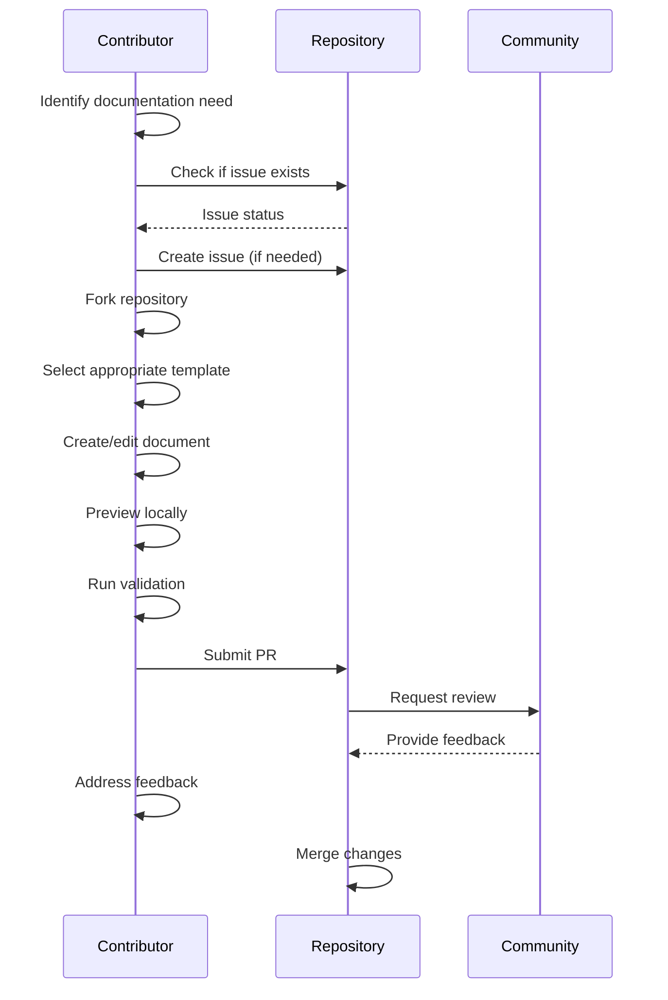
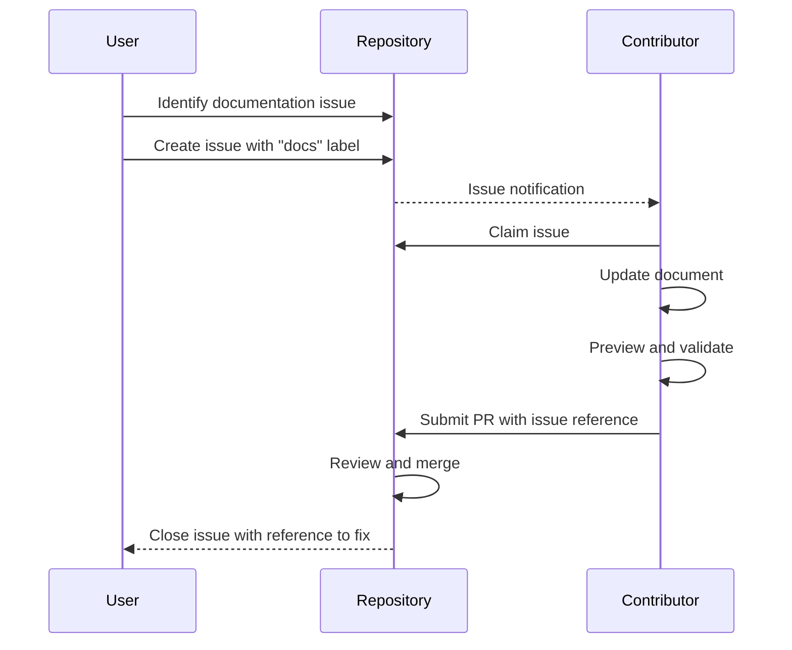

# Technical Design Specification: Documentation Contribution Guidelines

## 1. Overview

### 1.1 Purpose

This specification outlines a comprehensive system for documentation contributions to the pydapter project, focusing on structure, style guidelines, workflow processes, and templates to ensure consistent, high-quality documentation.

### 1.2 Scope

The scope includes:

- Documentation structure and organization guidelines
- Writing style and formatting conventions
- Documentation contribution workflow
- Templates for common documentation types
- Documentation validation and testing approaches

Out of scope:

- Content creation for specific documentation pages
- Automation of documentation generation from code
- Translation workflows (to be addressed in future phases)

### 1.3 Background

The research report (RR-41.md) identified the need for structured documentation contribution guidelines to ensure consistency across pydapter's documentation ecosystem while lowering the barrier to entry for new contributors. The report analyzed similar Python libraries like FastAPI, SQLAlchemy, and Pydantic to identify best practices for MkDocs-based documentation systems.

### 1.4 Design Goals

1. Create a clear, approachable structure for documentation contributors
2. Establish consistent style and formatting conventions
3. Define a straightforward contribution workflow
4. Provide reusable templates for common documentation types
5. Balance comprehensiveness with usability to encourage contributions

### 1.5 Key Constraints

1. Guidelines must work with the existing MkDocs-based documentation system
2. Documentation processes must integrate with pydapter's GitHub-based workflow
3. Guidelines should be approachable for contributors of varying experience levels
4. Documentation validation must be feasible in CI/CD pipelines

## 2. Architecture

### 2.1 Component Diagram



### 2.2 Dependencies

1. **Documentation framework**:
   - MkDocs (currently in use)
   - Material for MkDocs theme (currently in use)
   - mkdocstrings (for API documentation)

2. **Additional MkDocs plugins**:
   - mkdocs-literate-nav (for automated TOC)
   - mkdocs-section-index (for better navigation)
   - mkdocs-redirects (for URL management)
   - mkdocs-minify-plugin (for performance)

3. **Validation tools**:
   - markdownlint (for Markdown validation)
   - htmlproofer or similar (for HTML validation and link checking)

### 2.3 Data Flow



## 3. Interface Definitions

### 3.1 Documentation Structure Interface

The documentation should follow this high-level structure:

```
docs/
├── index.md                  # Project overview & quick start
├── getting_started.md        # Initial setup guide
├── guides/                   # Conceptual guides & tutorials
│   ├── concept_a.md
│   └── tutorial_b.md
├── adapters/                 # Adapter reference documentation
│   ├── adapter_a.md
│   └── adapter_b.md
├── api/                      # API reference (auto-generated)
│   ├── core.md
│   ├── adapters.md
│   └── extras.md
├── contributing/             # Contribution guides
│   ├── code.md
│   ├── documentation.md      # The documentation contribution guide
│   └── testing.md
└── reference/                # Additional reference material
    ├── faq.md
    └── glossary.md
```

### 3.2 Documentation Contribution Workflow

#### `Documentation Contribution Process`

**Purpose:** Standardize the workflow for documentation contributions

**Request Model:**
- Local setup requirements
- Content editing guidelines
- Preview instructions
- Pull request submission process

**Response Model:**
- Documentation change integrated into the repository
- Updated documentation site

**Error Responses:**
- Validation failures
- Build errors
- Missing required components

### 3.3 Documentation Templates

The following templates will be provided:

1. **Adapter Reference Template**
2. **Tutorial Template**
3. **Conceptual Guide Template**
4. **API Reference Conventions**

Each template will have clear sections and placeholders to guide contributors.

## 4. Data Models

### 4.1 Documentation Front Matter Model

```yaml
---
title: "Document Title"
summary: "Brief 1-2 sentence description"
category: "guide|reference|tutorial|api"
author: "contributor_name"
created: "YYYY-MM-DD"
updated: "YYYY-MM-DD"
version: "1.0"
---
```

### 4.2 Document Types

```python
class DocumentType(Enum):
    """Types of documentation with their specific requirements."""
    
    REFERENCE = {
        "required_sections": ["Overview", "Configuration", "Usage", "Examples"],
        "template": "reference_template.md",
        "audience": "Users seeking detailed information"
    }
    
    TUTORIAL = {
        "required_sections": ["Prerequisites", "Steps", "Conclusion", "Next Steps"],
        "template": "tutorial_template.md",
        "audience": "New users learning the library"
    }
    
    CONCEPT = {
        "required_sections": ["Introduction", "Details", "Use Cases", "Related Concepts"],
        "template": "concept_template.md",
        "audience": "Users seeking to understand deeper concepts"
    }
    
    API = {
        "required_sections": ["Class/Function Signature", "Parameters", "Returns", "Examples"],
        "template": "api_template.md",
        "audience": "Developers integrating with the library"
    }
```

### 4.3 Style Guide Model

```python
class StyleRule:
    """Representation of a style rule with examples."""
    
    def __init__(self, category, rule, correct_example, incorrect_example):
        self.category = category
        self.rule = rule
        self.correct_example = correct_example
        self.incorrect_example = incorrect_example

style_guide = [
    StyleRule(
        category="Tone",
        rule="Use present tense and active voice",
        correct_example="The adapter converts the data.",
        incorrect_example="The data is converted by the adapter."
    ),
    StyleRule(
        category="Formatting",
        rule="Use backticks for code elements",
        correct_example="Use the `JsonAdapter` class.",
        incorrect_example="Use the JsonAdapter class."
    ),
    # Additional style rules...
]
```

## 5. Behavior

### 5.1 Core Workflows

#### Document Creation Workflow



#### Document Update Workflow



### 5.2 Error Handling

Documentation contribution error handling covers:

1. **Validation errors**: Markdown syntax errors, broken links, etc.
2. **Template usage errors**: Missing required sections
3. **Style guide violations**: Inconsistent terminology, formatting issues
4. **Build failures**: Issues that prevent documentation from building

Each error type will include:
- Clear error descriptions
- Instructions for resolution
- Examples of correct implementations

### 5.3 Security Considerations

1. **Content security**:
   - Guidelines for avoiding inclusion of sensitive information (API keys, credentials)
   - Rules for external link validation and safety
   - Process for reviewing code examples for security issues

2. **Access control**:
   - Documentation on required permissions for contribution
   - Branch protection rules for documentation files
   - Guidelines for sensitive documentation (if applicable)

## 6. External Interactions

### 6.1 Dependencies on Other Services

The documentation system interacts with:

1. **GitHub**:
   - Repository for storing documentation source
   - Issue tracking for documentation needs
   - Pull request workflow for contributions

2. **CI/CD Pipeline**:
   - Automated document validation
   - Documentation site building
   - Preview environment generation

3. **MkDocs Plugins**:
   - Material theme for styling and components
   - mkdocstrings for API documentation generation
   - Additional plugins for navigation and features

### 6.2 External API Integrations

```python
class DocumentationCI:
    """Integration with CI system for documentation validation."""
    
    def validate_markdown(self, files):
        """Validate Markdown syntax and style guide compliance."""
        # Implementation
    
    def check_links(self, files):
        """Verify all links are valid and accessible."""
        # Implementation
    
    def build_preview(self, branch):
        """Build a preview of the documentation from a branch."""
        # Implementation
        
    def report_issues(self, validation_results):
        """Report any validation issues as check comments."""
        # Implementation
```

## 7. Performance Considerations

### 7.1 Expected Load

- 10-20 core documentation files
- 5-10 contributor-focused guides
- 20-30 reference documentation files (growing with adapters)
- 3-5 concurrent documentation contributors

### 7.2 Scalability Approach

1. **Modular documentation structure**:
   - Isolated adapter documentation that scales with new adapters
   - Centralized style guide and templates
   - Reference documentation generated from docstrings

2. **Versioned documentation**:
   - Structure supports future versioning as the project evolves
   - Clear delineation between version-specific content

### 7.3 Optimizations

1. **Documentation build performance**:
   - Minification of HTML/CSS/JS
   - Image optimization
   - Selective rebuilding of changed files

2. **Contributor efficiency**:
   - Templates with clear placeholders
   - Local validation tools
   - Reusable components and snippets

### 7.4 Caching Strategy

1. **Local development**:
   - MkDocs built-in caching for faster previews
   - Template caching for repeated use

2. **CI/CD Pipeline**:
   - Caching of documentation dependencies
   - Incremental builds where possible

## 8. Observability

### 8.1 Logging

Documentation contribution workflows will log:

1. Documentation build events and outcomes
2. Validation results and errors
3. Contributor activity metrics

### 8.2 Metrics

The following metrics will be tracked:

1. Documentation coverage (percentage of code with documentation)
2. Documentation quality scores from linting
3. Documentation build performance
4. Contributor activity and engagement

### 8.3 Tracing

For complex documentation tasks:

1. Tracing of end-to-end documentation workflows
2. Integration with GitHub's activity tracking
3. Analysis of documentation usage patterns (if analytics implemented)

## 9. Testing Strategy

### 9.1 Documentation Validation

Validation will verify:

1. Markdown syntax correctness
2. Style guide compliance
3. Required sections present
4. Front matter completeness

### 9.2 Link Validation

Link checking will:

1. Verify internal cross-references
2. Check external link validity
3. Ensure API reference links resolve correctly

### 9.3 Build Verification

Build testing will:

1. Ensure documentation builds successfully with `mkdocs build --strict`
2. Validate HTML output
3. Check for common rendering issues
4. Verify search functionality

## 10. Deployment and Configuration

### 10.1 Local Setup Requirements

```bash
# Install MkDocs and required plugins
pip install -r docs/requirements.txt

# Preview documentation locally
mkdocs serve

# Build documentation
mkdocs build --strict
```

### 10.2 Configuration Parameters

```yaml
# mkdocs.yml
site_name: pydapter
theme:
  name: material
  features:
    - navigation.tabs
    - navigation.sections
    - content.code.copy
    - content.tabs.link
    
markdown_extensions:
  - admonition
  - pymdownx.highlight
  - pymdownx.superfences:
      custom_fences:
        - name: mermaid
          class: mermaid
          format: !!python/name:pymdownx.superfences.fence_code_format
  - pymdownx.inlinehilite
  - pymdownx.tabbed
  - pymdownx.emoji

plugins:
  - search
  - mkdocstrings:
      handlers:
        python:
          selection:
            docstring_style: google
          rendering:
            show_source: true
  - literate-nav
  - section-index
  - redirects
  - minify
```

## 11. Open Questions

1. Should we implement a documentation review checklist, similar to code reviews?
2. How granular should our documentation templates be? Should we have different templates for different adapter types?
3. Should we prioritize implementing documentation versioning in the initial phase or postpone to a later phase?
4. What metrics should we track to assess documentation quality and coverage?

## 12. Risks & Mitigations

| Risk | Mitigation |
| --- | --- |
| Overly rigid guidelines discourage contributions | Balance clear standards with flexibility and provide examples rather than strict rules (pplx:5ba8ceeb-f75f-4960-a7b5-974b8cb25c64) |
| Maintenance burden for guidelines themselves | Automate validation where possible and schedule regular reviews of guidelines (pplx:a072c5e5-d5f9-42f3-a541-8b6b5c77b977) |
| Contributors not following guidelines | Create clear checklists, provide examples, and implement automated checks in CI pipeline (pplx:54664140-abd3-4299-9f75-555acf50071a) |
| Documentation becoming outdated as code evolves | Implement regular documentation reviews tied to release cycles and leverage generated API docs where possible |
| Learning curve for MkDocs and Markdown features | Provide a detailed setup guide with examples of advanced features and inline documentation for MkDocs-specific syntax |

## 13. Appendices

### Appendix A: Alternative Designs

#### Minimal Viable Guidelines

A simpler approach would focus only on core style and structure requirements without comprehensive templates and validation. This would be faster to implement but might result in less consistent documentation.

#### Template-Driven Approach

An alternative would be to rely heavily on templates with minimal explanatory guidelines. This approach would ensure structural consistency but might not address style and content quality.

#### Tool-Driven Approach

This approach would implement automated linting and formatting tools with minimal written guidelines. This would enforce technical correctness but might not address higher-level content organization and quality concerns.

### Appendix B: Research References

1. FastAPI Documentation Guide (pplx:54664140-abd3-4299-9f75-555acf50071a) - Reference for well-structured documentation contribution process
2. Pydantic Documentation Contribution Guidelines (pplx:5ba8ceeb-f75f-4960-a7b5-974b8cb25c64) - Example of MkDocs-based documentation practices
3. SQLAlchemy Documentation Structure (pplx:d38b4ea1-1b27-4283-ab72-9c5771270e78) - Reference for detailed technical documentation
4. MkDocs Best Practices (pplx:a072c5e5-d5f9-42f3-a541-8b6b5c77b977) - Guidelines specific to MkDocs-based documentation

### Appendix C: Document Type Templates

#### Adapter Reference Template

```markdown
# [Adapter Name] Adapter

## Overview

Brief description of the adapter and its purpose.

## Installation

```bash
pip install pydapter[adapter-name]
```

## Configuration

| Parameter | Type | Required | Default | Description |
|-----------|------|----------|---------|-------------|
| `param1`  | str  | Yes      | -       | Description |
| `param2`  | int  | No       | 10      | Description |

## Basic Usage

```python
from pydapter.adapters import AdapterName

adapter = AdapterName(config_param="value")
result = adapter.operation(input_data)
```

## Advanced Features

Description of advanced features with examples...

## Error Handling

How to handle common errors...

## Performance Considerations

Tips for optimizing performance...

## Related Adapters

- [Link to related adapter 1]
- [Link to related adapter 2]
```

#### Tutorial Template

```markdown
# Tutorial: [Topic]

## Prerequisites

- Requirement 1
- Requirement 2

## Introduction

Brief introduction to the tutorial's purpose and what the reader will learn.

## Step 1: [First Step]

Description and code example...

```python
# Code for step 1
```

## Step 2: [Second Step]

Description and code example...

```python
# Code for step 2
```

## Step 3: [Third Step]

Description and code example...

```python
# Code for step 3
```

## Conclusion

Summary of what was learned and accomplished.

## Next Steps

- Suggestion 1
- Suggestion 2
- Related tutorial: [Link]