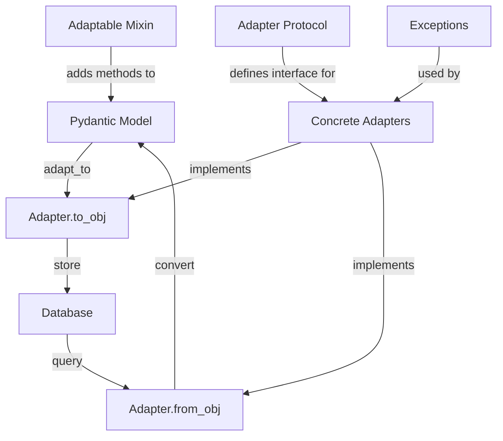
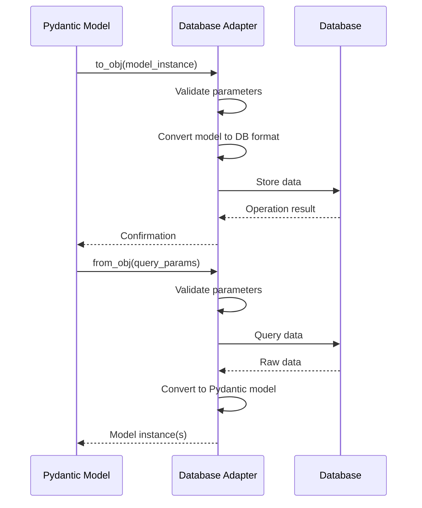

# Technical Design Specification: Database Adapter Integration

## 1. Overview

### 1.1 Purpose

This specification defines the implementation requirements for integrating three new database adapters into the Pydapter framework:
1. AsyncNeo4jAdapter (Issue #67)
2. WeaviateAdapter (Issue #68)
3. AsyncWeaviateAdapter (Issue #68)

The goal is to extend Pydapter's capabilities to include asynchronous Neo4j operations and both synchronous and asynchronous Weaviate vector database operations.

### 1.2 Scope

This design covers:
- Implementation details for each adapter
- Error handling patterns
- Interface consistency requirements
- Parameter validation protocols
- Resource management strategies
- Testing requirements

It does not cover:
- Changes to the core adapter protocols
- Performance optimization beyond basic patterns
- Database-specific application logic

### 1.3 Background

As outlined in the Research Report (RR-adapter-integration-patterns), the dev directory contains preliminary implementations of these adapters. These implementations are functional but lack comprehensive error handling, proper resource management, and consistency with established patterns.

The existing Neo4j adapter and AsyncPostgres adapters provide a reference for proper implementation patterns. The research identified several gaps that need to be addressed in the current dev implementations.

### 1.4 Design Goals

1. **Consistency**: Ensure all adapters follow established Pydapter interface and error handling patterns
2. **Reliability**: Implement robust error handling and resource management
3. **Security**: Add appropriate validation to prevent injection and security issues
4. **Testability**: Provide a clear testing strategy for validating adapter functionality
5. **Maintainability**: Structure code to be consistent with existing adapters for easier maintenance

### 1.5 Key Constraints

- Must maintain compatibility with the core adapter protocols
- Must follow established error handling patterns 
- Must implement proper resource management, especially for async adapters
- Must include comprehensive validation
- Must be thoroughly tested with both unit and integration tests

## 2. Architecture

### 2.1 Component Diagram



### 2.2 Dependencies

1. **AsyncNeo4jAdapter**:
   - neo4j.AsyncGraphDatabase (from neo4j library)
   - Pydantic v2

2. **WeaviateAdapter**:
   - weaviate-client (for synchronous operations)
   - Pydantic v2

3. **AsyncWeaviateAdapter**:
   - aiohttp (for async HTTP calls)
   - Pydantic v2

All adapters also depend on the core Pydapter modules:
- pydapter.core or pydapter.async_core
- pydapter.exceptions

### 2.3 Data Flow



## 3. Interface Definitions

### 3.1 AsyncNeo4jAdapter Interface

```python
class AsyncNeo4jAdapter(AsyncAdapter[T]):
    obj_key = "async_neo4j"
    
    @classmethod
    async def from_obj(
        cls, subj_cls: type[T], obj: dict, /, *, many: bool = False, **kw
    ) -> T | list[T]: ...
    
    @classmethod
    async def to_obj(
        cls, subj: T | list[T], /, *, url: str, label: str = None, 
        merge_on: str = "id", auth: tuple = None, **kw
    ) -> dict: ...
    
    @classmethod
    async def _create_driver(cls, url: str, auth=None) -> neo4j.AsyncDriver: ...
    
    @classmethod
    def _validate_cypher(cls, cypher: str) -> None: ...
```

### 3.2 WeaviateAdapter Interface

```python
class WeaviateAdapter(Adapter[T]):
    obj_key = "weav"
    
    @classmethod
    def from_obj(
        cls, subj_cls: type[T], obj: dict, /, *, many: bool = True, **kw
    ) -> T | list[T]: ...
    
    @classmethod
    def to_obj(
        cls, subj: T | list[T], /, *, class_name: str,
        vector_field: str = "embedding", url: str = None, **kw
    ) -> None: ...
    
    @staticmethod
    def _client(url: str | None): ...
```

### 3.3 AsyncWeaviateAdapter Interface

```python
class AsyncWeaviateAdapter(AsyncAdapter[T]):
    obj_key = "async_weav"
    
    @classmethod
    async def from_obj(
        cls, subj_cls: type[T], obj: dict, /, *, many: bool = True, **kw
    ) -> T | list[T]: ...
    
    @classmethod
    async def to_obj(
        cls, subj: T | list[T], /, *, class_name: str,
        url: str = "http://localhost:8080", vector_field: str = "embedding", **kw
    ) -> None: ...
```

## 4. Implementation Details

### 4.1 AsyncNeo4jAdapter

#### Required Parameters

**from_obj**:
- `url`: Neo4j server URL
- `label` (optional): Node label to query (defaults to model class name)
- `where` (optional): Cypher WHERE clause
- `auth` (optional): Authentication tuple (username, password)

**to_obj**:
- `url`: Neo4j server URL
- `label` (optional): Node label to use (defaults to model class name)
- `merge_on`: Property to use for MERGE operations (defaults to "id")
- `auth` (optional): Authentication tuple (username, password)

#### Error Handling

```python
@classmethod
async def from_obj(cls, subj_cls: type[T], obj: dict, /, *, many=False, **kw):
    try:
        # Validate required parameters
        if "url" not in obj:
            raise AdapterValidationError("Missing required parameter 'url'", data=obj)

        # Create driver
        auth = obj.get("auth")
        driver = await cls._create_driver(obj["url"], auth=auth)

        # Prepare and validate Cypher query
        label = obj.get("label", subj_cls.__name__)
        where = f"WHERE {obj['where']}" if "where" in obj else ""
        cypher = f"MATCH (n:`{label}`) {where} RETURN n"
        cls._validate_cypher(cypher)

        # Execute query
        try:
            async with driver:
                async with driver.session() as s:
                    result = await s.run(cypher)
                    rows = [r["n"]._properties async for r in result]
        except neo4j.exceptions.CypherSyntaxError as e:
            raise QueryError(
                f"Neo4j Cypher syntax error: {e}", query=cypher, adapter="async_neo4j"
            ) from e
        except neo4j.exceptions.ClientError as e:
            if "not found" in str(e).lower():
                raise ResourceError(
                    f"Neo4j resource not found: {e}", resource=label
                ) from e
            raise QueryError(
                f"Neo4j client error: {e}", query=cypher, adapter="async_neo4j"
            ) from e
        except Exception as e:
            raise QueryError(
                f"Error executing Neo4j query: {e}", query=cypher, adapter="async_neo4j"
            ) from e

        # Handle empty result set
        if not rows:
            if many:
                return []
            raise ResourceError(
                "No nodes found matching the query",
                resource=label,
                where=obj.get("where", ""),
            )

        # Convert rows to model instances
        try:
            if many:
                return [subj_cls.model_validate(r) for r in rows]
            return subj_cls.model_validate(rows[0])
        except ValidationError as e:
            raise AdapterValidationError(
                f"Validation error: {e}",
                data=rows[0] if not many else rows,
                errors=e.errors(),
            ) from e

    except (ConnectionError, QueryError, ResourceError, AdapterValidationError):
        # Re-raise our custom exceptions
        raise
    except Exception as e:
        # Wrap other exceptions
        raise QueryError(f"Unexpected error in async Neo4j adapter: {e}", adapter="async_neo4j")
```

Similar error handling pattern should be applied to the `to_obj` method.

#### Resource Management

- Use `async with` for all driver and session management
- Ensure proper cleanup of resources in failure cases
- Follow structured error handling pattern from existing adapters

### 4.2 WeaviateAdapter

#### Required Parameters

**from_obj**:
- `class_name`: Weaviate class name to query
- `query_vector`: Vector to use for similarity search
- `url` (optional): Weaviate server URL (defaults to http://localhost:8080)
- `top_k` (optional): Number of results to return (defaults to 5)

**to_obj**:
- `class_name`: Weaviate class name to store data in
- `vector_field`: Model field containing the vector (defaults to "embedding")
- `url` (optional): Weaviate server URL (defaults to http://localhost:8080)

#### Error Handling

```python
@classmethod
def from_obj(cls, subj_cls: type[T], obj: dict, /, *, many=True, **kw):
    try:
        # Validate required parameters
        if "class_name" not in obj:
            raise AdapterValidationError("Missing required parameter 'class_name'", data=obj)
        if "query_vector" not in obj:
            raise AdapterValidationError("Missing required parameter 'query_vector'", data=obj)
            
        # Create client
        try:
            client = cls._client(obj.get("url"))
        except Exception as e:
            raise ConnectionError(
                f"Failed to connect to Weaviate: {e}", 
                adapter="weav", 
                url=obj.get("url", "http://localhost:8080")
            ) from e
            
        # Execute query
        try:
            res = (
                client.query.get(obj["class_name"], ["*"])
                .with_near_vector({"vector": obj["query_vector"]})
                .with_limit(obj.get("top_k", 5))
                .do()
            )
        except Exception as e:
            raise QueryError(
                f"Weaviate query failed: {e}", 
                adapter="weav",
                query=f"nearVector:{obj['class_name']}"
            ) from e
            
        # Check for errors in response
        if "errors" in res:
            raise QueryError(
                f"Weaviate query returned errors: {res['errors']}", 
                adapter="weav",
                query=f"nearVector:{obj['class_name']}"
            )
            
        # Process results
        data = res["data"]["Get"][obj["class_name"]]
        
        # Handle empty result set
        if not data:
            if many:
                return []
            raise ResourceError(
                "No objects found matching the query",
                resource=obj["class_name"]
            )
            
        # Convert to models
        try:
            if many:
                return [subj_cls.model_validate(r) for r in data]
            return subj_cls.model_validate(data[0])
        except ValidationError as e:
            raise AdapterValidationError(
                f"Validation error: {e}",
                data=data[0] if not many else data,
                errors=e.errors(),
            ) from e
            
    except (ConnectionError, QueryError, ResourceError, AdapterValidationError):
        # Re-raise our custom exceptions
        raise
    except Exception as e:
        # Wrap other exceptions
        raise QueryError(f"Unexpected error in Weaviate adapter: {e}", adapter="weav")
```

Similar error handling pattern should be applied to the `to_obj` method.

### 4.3 AsyncWeaviateAdapter

#### Required Parameters

Same as the synchronous WeaviateAdapter, but with async implementation.

#### Error Handling

```python
@classmethod
async def from_obj(cls, subj_cls: type[T], obj: dict, /, *, many=True, **kw):
    try:
        # Validate required parameters
        if "class_name" not in obj:
            raise AdapterValidationError("Missing required parameter 'class_name'", data=obj)
        if "query_vector" not in obj:
            raise AdapterValidationError("Missing required parameter 'query_vector'", data=obj)
            
        # Prepare query
        query = {
            "query": """
            {
              Get {
                %s(nearVector: {vector: %s}, limit: %d) {
                  _additional { id }
                  ... on %s { * }
                }
              }
            }
            """
            % (
                obj["class_name"],
                json.dumps(obj["query_vector"]),
                obj.get("top_k", 5),
                obj["class_name"],
            )
        }
        
        # Execute query
        try:
            async with aiohttp.ClientSession() as sess:
                async with sess.post(
                    f"{obj.get('url', 'http://localhost:8080')}/v1/graphql", json=query
                ) as resp:
                    if resp.status >= 400:
                        error_text = await resp.text()
                        raise QueryError(
                            f"Weaviate HTTP error: {resp.status} - {error_text}",
                            adapter="async_weav",
                            query=query
                        )
                    data = await resp.json()
        except aiohttp.ClientError as e:
            raise ConnectionError(
                f"Failed to connect to Weaviate: {e}",
                adapter="async_weav",
                url=obj.get("url", "http://localhost:8080")
            ) from e
        except Exception as e:
            if isinstance(e, QueryError):
                raise
            raise QueryError(
                f"Error executing Weaviate query: {e}",
                adapter="async_weav",
                query=query
            ) from e
            
        # Check for errors in response
        if "errors" in data:
            raise QueryError(
                f"Weaviate query returned errors: {data['errors']}",
                adapter="async_weav",
                query=query
            )
            
        # Process results
        if not data.get("data", {}).get("Get", {}).get(obj["class_name"]):
            raise QueryError(
                f"Invalid response format from Weaviate: {data}",
                adapter="async_weav",
                query=query
            )
            
        recs = data["data"]["Get"][obj["class_name"]]
        
        # Handle empty result set
        if not recs:
            if many:
                return []
            raise ResourceError(
                "No objects found matching the query",
                resource=obj["class_name"]
            )
            
        # Convert to models
        try:
            if many:
                return [subj_cls.model_validate(r) for r in recs]
            return subj_cls.model_validate(recs[0])
        except ValidationError as e:
            raise AdapterValidationError(
                f"Validation error: {e}",
                data=recs[0] if not many else recs,
                errors=e.errors(),
            ) from e
            
    except (ConnectionError, QueryError, ResourceError, AdapterValidationError):
        # Re-raise our custom exceptions
        raise
    except Exception as e:
        # Wrap other exceptions
        raise QueryError(f"Unexpected error in async Weaviate adapter: {e}", adapter="async_weav")
```

Similar error handling pattern should be applied to the `to_obj` method.

#### Resource Management

- Use `async with` for aiohttp sessions to ensure proper cleanup
- Handle HTTP error codes appropriately
- Ensure proper resource cleanup even in error cases

## 5. Error Handling Strategy

### 5.1 Adapter-Specific Exceptions

All adapters must use the standardized exception hierarchy from Pydapter:

```python
from pydapter.exceptions import (
    ConnectionError,      # For connection issues
    QueryError,           # For query execution failures
    ResourceError,        # For resource not found errors
    ValidationError,      # For data validation issues
    AdapterError,         # Base exception for generic issues
    AdapterValidationError, # For adapter parameter validation issues
)
```

### 5.2 Exception Patterns

1. **Parameter Validation Errors**: Raise `AdapterValidationError` early in the method flow
2. **Connection Errors**: Wrap database-specific connection exceptions in `ConnectionError`
3. **Query Errors**: Wrap database-specific query exceptions in `QueryError`
4. **Resource Errors**: Raise `ResourceError` when a resource is not found
5. **Validation Errors**: Wrap Pydantic validation exceptions in `AdapterValidationError`
6. **Unexpected Errors**: Catch and wrap all other exceptions in appropriate adapter exceptions

### 5.3 Error Context

All exceptions should include:
1. A descriptive error message
2. The adapter name (e.g., "async_neo4j")
3. Relevant context data (e.g., query, url, etc.)
4. The original exception as cause (using `from e` syntax)

Example:
```python
except neo4j.exceptions.CypherSyntaxError as e:
    raise QueryError(
        f"Neo4j Cypher syntax error: {e}",
        query=cypher,
        adapter="async_neo4j"
    ) from e
```

## 6. Testing Strategy

### 6.1 Unit Testing

#### Protocol Compliance Tests

Each adapter must be tested for protocol compliance:

```python
def test_async_neo4j_adapter_protocol_compliance():
    """Test that AsyncNeo4jAdapter implements AsyncAdapter protocol."""
    assert isinstance(AsyncNeo4jAdapter, AsyncAdapter)
    assert hasattr(AsyncNeo4jAdapter, "obj_key")
    assert hasattr(AsyncNeo4jAdapter, "from_obj")
    assert hasattr(AsyncNeo4jAdapter, "to_obj")
    assert AsyncNeo4jAdapter.obj_key == "async_neo4j"
```

#### Mock-Based Unit Tests

Each adapter should have comprehensive mock-based unit tests:

```python
@pytest.mark.asyncio
async def test_async_neo4j_adapter_from_obj(mocker):
    """Test AsyncNeo4jAdapter.from_obj with mocked Neo4j driver."""
    # Setup mock
    mock_driver = mocker.AsyncMock()
    mock_session = mocker.AsyncMock()
    mock_result = mocker.AsyncMock()
    mock_driver.session.return_value.__aenter__.return_value = mock_session
    mock_session.run.return_value = mock_result
    
    # Mock async iterator
    mock_record = {"n": mocker.Mock(_properties={"id": 1, "name": "Test"})}
    mock_result.__aiter__.return_value = [mock_record]
    
    # Patch driver creation
    mocker.patch.object(
        AsyncGraphDatabase, "driver", return_value=mock_driver
    )
    
    # Test
    result = await AsyncNeo4jAdapter.from_obj(
        TestModel, {"url": "neo4j://localhost", "label": "Test"}
    )
    
    # Assertions
    assert isinstance(result, list)
    assert len(result) == 1
    assert isinstance(result[0], TestModel)
    assert result[0].id == 1
    assert result[0].name == "Test"
    
    # Verify mock calls
    mock_session.run.assert_called_once()
    mock_driver.__aenter__.assert_called_once()
    mock_session.__aenter__.assert_called_once()
```

### 6.2 Error Handling Tests

Each adapter should have comprehensive error handling tests:

```python
@pytest.mark.asyncio
async def test_async_neo4j_adapter_validation_error(mocker):
    """Test that missing URL raises appropriate error."""
    with pytest.raises(AdapterValidationError) as exc_info:
        await AsyncNeo4jAdapter.from_obj(TestModel, {})
    
    assert "Missing required parameter 'url'" in str(exc_info.value)
```

### 6.3 Integration Tests

Integration tests should be added to verify actual database interaction:

```python
@pytest.mark.integration
@pytest.mark.asyncio
async def test_async_neo4j_adapter_integration(neo4j_container):
    """Integration test using a real Neo4j instance."""
    # Setup test data
    url = f"neo4j://{neo4j_container.host}:{neo4j_container.mapped_port}"
    auth = ("neo4j", "password")
    
    # Create test model
    test_model = TestModel(id=1, name="Integration Test")
    
    # Store via adapter
    await AsyncNeo4jAdapter.to_obj(
        test_model, url=url, auth=auth, label="TestNode"
    )
    
    # Retrieve via adapter
    result = await AsyncNeo4jAdapter.from_obj(
        TestModel,
        {"url": url, "auth": auth, "label": "TestNode", "where": "n.id = 1"},
        many=False
    )
    
    # Assertions
    assert isinstance(result, TestModel)
    assert result.id == 1
    assert result.name == "Integration Test"
```

## 7. Performance Considerations

### 7.1 Connection Pooling

- Neo4j adapters should leverage connection pooling capabilities in the Neo4j driver
- AsyncWeaviateAdapter should reuse aiohttp ClientSession objects when possible

### 7.2 Batch Operations

All adapters should support efficient batch operations when handling multiple items:

```python
# Example batch operation in to_obj
async with driver.session() as s:
    for it in items:
        props = it.model_dump()
        cypher = f"MERGE (n:`{label}` {{{merge_on}: $val}}) SET n += $props"
        await s.run(cypher, val=props[merge_on], props=props)
```

### 7.3 Resource Cleanup

Adapters must ensure proper resource cleanup to prevent leaks:

- Use `async with` for all async resources
- Close connections explicitly in finally blocks
- Handle errors during cleanup properly

## 8. Implementation Roadmap

### 8.1 Phase 1: Error Handling and Protocol Compliance

1. Update AsyncNeo4jAdapter
   - Add parameter validation
   - Add error handling
   - Add Cypher validation
   - Ensure proper resource management
   
2. Update WeaviateAdapter
   - Add parameter validation
   - Add error handling
   - Ensure proper client management
   
3. Update AsyncWeaviateAdapter
   - Add parameter validation
   - Add error handling for HTTP operations
   - Ensure proper session management

### 8.2 Phase 2: Testing and Documentation

1. Implement unit tests for all adapters
2. Implement protocol compliance tests
3. Add integration tests with test containers
4. Create documentation for usage examples

### 8.3 Phase 3: Performance Optimization

1. Implement connection pooling where applicable
2. Add batch processing optimizations
3. Add monitoring and logging improvements

## 9. Risks and Mitigations

### 9.1 Async Resource Leaks

**Risk**: Improper async resource management can lead to connection or memory leaks.

**Mitigation**:
- Use `async with` for all async resources
- Implement explicit cleanup in finally blocks
- Add tests specifically for resource cleanup scenarios

### 9.2 Database Version Compatibility

**Risk**: Neo4j and Weaviate have multiple versions with different APIs and behaviors.

**Mitigation**:
- Specify minimum supported database versions
- Add version detection and compatibility checks
- Test against multiple database versions

### 9.3 Error Propagation

**Risk**: Inconsistent error handling could lead to confusing user experiences.

**Mitigation**:
- Implement standardized error handling across all adapters
- Provide detailed context in error messages
- Add comprehensive error handling tests

### 9.4 Breaking API Changes

**Risk**: Changes to current API might break existing applications using the dev implementations.

**Mitigation**:
- Keep method signatures compatible with current implementations
- Document any necessary breaking changes
- Consider version-specific compatibility layers if needed

## 10. Open Questions

1. Should the AsyncNeo4jAdapter use connection pooling by default?
2. What should be the default batch size for bulk operations in WeaviateAdapter?
3. Should we support authentication methods beyond basic auth for Weaviate?

## Appendix A: Research References

1. Research Report: RR-adapter-integration-patterns.md
2. Perplexity search ID: pplx:ef2cf27a-6688-4667-804a-d5d31f3f79a5